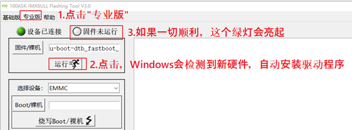

# IMX6ULL_PRO 开发板使用步骤


## 0. 环境

```bash
sudo apt-get install build-essential libncurses5-dev lzop
```


## 1. 代码&工具链


下载代码和工具链：

```bash
git clone https://e.coding.net/codebug8/repo.git

mkdir -p 100ask_imx6ull-sdk && cd 100ask_imx6ull-sdk

../repo/repo init -u \
 https://gitee.com/weidongshan/manifests.git -b \
linux-sdk -m imx6ull/100ask_imx6ull_linux4.9.88_release.xml  --no-repo-verify

../repo/repo sync -j4
```


更新代码（在 100ask_imx6ull-sdk 目录下执行命令）：

```bash
../repo/repo sync -c
```


## 2. 配置交叉编译工具链

在 ~/.bashrc 文件末尾添加：

```bash
export ARCH=arm
export CROSS_COMPILE=arm-buildroot-linux-gnueabihf-
export PATH=$PATH:/home/book/100ask_imx6ull-sdk/ToolChain/arm-buildroot-linux-gnueabihf_sdk-buildroot/bin
```


## 3. 构建 bootloader、内核、文件系统


### 3.1 Bootloader

```bash
cd Uboot-2017.03

make distclean

make  mx6ull_14x14_evk_defconfig

make
```

编译完成后，生成 u-boot-dtb.imx 用于 TF 卡启动和 EMMC 启动。

除了使用上位机工具外，还可以将 u-boot-dtb.imx 拷贝到开发板上，然后执行一下命令烧写到 emmc 上。

```bash
# 解除写保护
echo 0 > /sys/block/mmcblk1boot0/force_ro

dd if=u-boot-dtb.imx of=/dev/mmcblk1boot0 bs=512 seek=2

# 重新开启写保护
echo 1 > /sys/block/mmcblk1boot0/force_ro
```

重启开发板即可。


### 3.2 Linux Kernel

```bash
cd Linux-4.9.88

make mrproper

make 100ask_imx6ull_defconfig

make zImage -j4

make dtbs

# 编译内核模块
make modules 

# 安装内核模块
make INSTALL_MOD_PATH=/xxxx/xxxx modules_install
```

内核输出：arch/arm/boot/zImage

设备树：arch/arm/boot/dts/100ask_imx6ull-14x14.dtb


安装内核、设备树、内核模块到开发板。

```bash
# 首先，将编译好的 zImage、dtb 文件拷贝到 nfs 目录下。
# 第二，通过 INSTALL_MOD_PATH 将内核模块安装到 nfs 目录下。
# 第三，开发板挂在 nfs 目录到板子的 /mnt 目录。
# 第四，执行命令：
cp /mnt/zImage /boot
cp /mnt/*.dtb /boot
cp /mnt/lib/modules /lib -rfd
```


### 3.3 使用Buildroot构建

- 确定配置文件

  在`Buildroot-2020.02.x/configs`目录下，存放了一下defconfig文件。

  - 100ask_imx6ull_pro_ddr512m_systemV_core_defconfig：使用systemV守护进程的系统(包含基本工具集包)
  - 100ask_imx6ull_pro_ddr512m_systemV_qt5_defconfig：使用systemV守护进程的系统，包含Qt GUI文件系统版本(出厂系统默认)

- 编译过程（需要很长时间，可能5~6小时）

  ```bash
  cd Buildroot_2020.02.x
  
  make clean
  
  make 100ask_imx6ull_pro_ddr512m_systemV_qt5_defconfig
  
  make all
  ```

- 输出目录

  编译成功后，输出目录如下：

  ```bash
  buildroot2020.02.x	
  	├── output
  		├── images	
  			├── 100ask_imx6ull-14x14.dtb	<--设备树文件	
  			├── rootfs.ext2					<--ext2格式根文件系统
  			├── rootfs.ext4 -> rootfs.ext2		<--ext2格式根文件系统	
  			├── rootfs.tar					
  			├── rootfs.tar.bz2				<--打包并压缩的根文件系统，用于NFSROOT启动
  			├── 100ask-imx6ull-pro-512d-systemv-v1.img			<--完整的系统镜像(可以用来烧写emmc和sd卡)
  			├── u-boot-dtb.imx				<--u-boot镜像
  			└── zImage					<--内核镜像
  
  ```

- 常用编译指令

  ```bash
  # 进入menuconfig界面
  make menuconfig
  
  # 单独编译内核
  make linux-rebuild
  
  # 进入内核make menuconfig配置选项界面
  make linux-menuconfig
  
  # 单独编译u-boot
  make uboot-rebuild
  
  # 单独编译某个软件包
  make <pkg>-rebuild
  
  # 进入busybox配置界面
  make busybox-menuconfig
  
  # 生成系统sdk,最后生成的目录在output/images/目录下
  make sdk
  ```


## 4. 烧写镜像到开发板


### 4.1 开发板启动开关


USB 模式主要用来烧写系统，而且 USB 启动模式下，不能插上 SD/TF 卡。

要在USB启动模式下烧写SD/TF卡时，需要**先上电再插卡，先上电再插卡，先上电再插卡**。


### 4.2 Windows 烧写工具

工具名：01_Tools(工具)/100ask_imx6ull烧写工具/100ask_imx6ull_flashing_tool.exe

工具特点：

- 可以烧写整个系统，也可以分开烧写bootloader、内核、设备树
- 可以上传用户文件到开发板系统中任意目录里
- 烧写速度是原厂工具（mfgtools）的5倍
- 支持所有厂家的开发板烧写，注意：不只是支持100ASK_IMX6ULL，还支持其他厂家的IMX6ULL开发板


”基础版”是专为 100ASK_IMX6ULL 设计的，点击一下即可完成某项烧写。

“专业版”功能更强大，特别是它可以上传文件到某个分区、某个目录。有些厂家的开发板，zImage 和设备树是在第1个分区里的，而100ASK_IMX6ULL 的 zImage 和设备树是在第 2 个分区里，所以这些厂家的开发板就无法使用基础版来烧写，需要使用专业版，指定分区、指定分区格式、指定路径，然后再上传文件。


烧写工具目录：


要留意的是 files 目录下的文件，各文件的作用在上图中列出来了，文件名不能改变，要更新某文件时需要覆盖旧文件。

如果要更新某个文件，把新文件放进去覆盖同名文件即可。


**驱动安装（自动）：**

- 连接 USB OTG 线。
- USB 模式上电启动（上电时不要插 SD/TF 卡）。
- 默认情况下会自动安装驱动，烧写软件的绿灯不亮时，则很有可能是驱动程序没有安装好。

IMX6ULL 开发板会通过这一个 OTG 口，模拟出 2 个 USB 设备(先后模拟，不是同时)：“Freescale SE Blank 6ULL”、“USB download gadget”。一般会自动安装好驱动程序，如果驱动程序没安装好，你可以去下载“zadig”来安装驱动。


**手动安装驱动：**

- **安装第一个驱动**：只要开发板设为USB启动(不要插SD/TF卡)并上电，电脑就会识别出“Freescale SE Blank 6ULL”设备，一般都会自动给它安装驱动程序。如果没有自动安装好驱动程序(“设备已连接”绿灯没亮)，要使用zadig安装libusb-win32驱动。

  - 先去 https://zadig.akeo.ie/ 下载zadig并运行，然后参考下图安装驱动程序：

    

- **安装第二个驱动**：当烧写工具的“设备已连接”绿灯亮起，就可以在“专业版”点击“运行”按钮，这时电脑会识别出 “USB download gadget” 设备，一般都会自动给它安装驱动程序，如下图：

  

  如果没有自动安装好驱动程序(“固件已运行”绿灯没亮)，先去 https://zadig.akeo.ie/ 下载 zadig 并运行，然后参考下图安装驱动程序：

  

  如果一切正常，烧写工具的2个绿灯都会亮，如下：

  

  这就表示所有驱动都安装好了，可以重启开发板，开始烧写过程。


### 4.3 基础版烧写

要更新某个文件，就把它复制到烧写工具的files目录，比如zImage、100ask_imx6ull-14x14.dtb。

**举例**：要更新内核，先把新的zImage覆盖files目录下的zImage，然后接线，上电，选择设备，点击“更新内核”即可。


## 5. 常用NFS命令

```bash
mount -t nfs -o nolock,vers=3 192.168.100.158:/home/linux/nfs /mnt
```


## 6. 应用程序demo

```bash
git clone https://e.coding.net/weidongshan/01_all_series_quickstart.git
```

