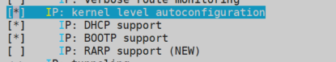

## 1. 背景

嵌入式 Linux 开发中，提到 NFS，一般都是 NFS 整个文件系统，有时候觉得没啥必要。板子上已经有文件系统了，直接 NFS 挂载单个目录不也是很香吗。所以，需求就是：`嵌入式操作系统挂载本地文件系统后，通过 NFS 挂载上位机指定目录，以便于调试驱动模块或者应用程序。`

## 2. 工作量分析

- Host 上位机：搭建 NFS Server，创建运行下位机挂载的目录。
- 嵌入式设备：Linux 内核添加 NFS 支持。
- 网络：上位机和嵌入式设备都得联网，而且还得是同一网段。要是网络都不通，那就趁早歇了吧。

## 3. 上位机搭建NFS Server

### 3.1 上位机环境

- 操作系统：ubuntu 20.04
- IP地址：192.168.1.100
- 供下位机挂载的目录：/haveFun

### 3.2 创建目录

```shell
sudo mkdir /haveFun
```

为了之后的验证方便，可以在目录下创建个测试文件：

```shell
sudo touch /haveFun/helloWorld
```

### 3.3 安装配置 NFS Server 服务

- 安装 NFS Server 服务

```shell
sudo apt-get install nfs-kernel-server
```

- 配置共享目录


打开 /etc/exports 文件，注意，要用`sudo`

```shell
sudo vi /etc/exports
```

在文件的末尾添加如下信息：

```
/haveFun *(rw,nohide,insecure,no_subtree_check,async,no_root_squash)
```

关于 /etc/exports 的语法以后再说，感兴趣的可以百度，但一定要注意，只有在`/haveFun`和`*(`之间有个空格，其他地方都别加空格。

- 重启NFS服务

重启 NFS 服务，使配置生效。

```shell
sudo /etc/init.d/nfs-kernel-server restart
```

- 验证是否配置成功

该配置的配完了，也重启了，现在就让上位机自己挂载自己的目录试试。

```shell
sudo mount -t nfs -o nolock,vers=3 localhost:/haveFun /mnt
```

上面这个命令就是通过NFS服务把`/haveFun`目录挂载到`/mnt`目录下，如果挂载成功，那么在`/mnt`目录下应该能看到`helloWorld`文件。

```shell
ls /mnt
```

如果`/mnt`目录下有`helloWorld`文件，那就说明上位机的工作都搞定了，使用下面的命令卸载刚才挂载的目录：

```shell
sudo umount /mnt
```

至此，上位机搞定。

## 4. 嵌入式设备配置

- 内核版本：3.0.15
- 嵌入式设备IP：192.168.1.15

### 4.1 Linux内核添加NFS支持

- 第1步，在 Linux 源码目录下执行`make menuconfig`命令，进入配置界面。


- 第2步，依次选择`Networking support` -> `Networking options`


- 第3步，选中`IP: Kernel level autoconfiguration`、`IP: DHCP support`、`IP: BOOTP support`三个选项。



- 第4步，点击`<Exit>`退回配置界面首页，选择`File Systems`->`Network File Systems`。注意，`Network File Systems`设置为`*`。


- 第5步，依次选中下图中显示为`*`的几项：


- 第6步，保存，退出配置界面。

- 第7步，编译内核，烧写到设备中。

### 4.2 嵌入式设备挂载目录

- 第1步，设备上电开机。

- 第2步，使用`ping 192.168.1.100`验证与 NFS Server 之间的网络连接是否正常。

- 第3步，挂载目录

```shell
mount -t nfs -o nolock,vers=3 192.168.1.100:/haveFun /mnt
```

挂载完成后，就可以在`/mnt`目录下看到`helloWorld`文件了。
