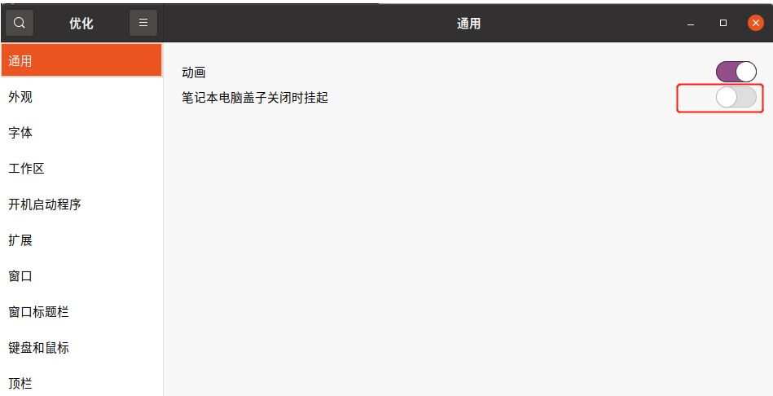
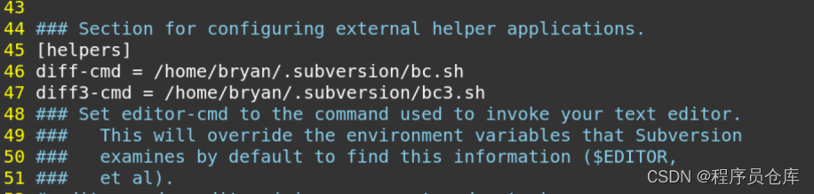

## 1. 系统安装

[制作UbuntuU盘启动 - 知乎 (zhihu.com)](https://zhuanlan.zhihu.com/p/197908477)


## 2. openssh-server 安装

```bash
sudo apt-get install -y openssh-server
```


## 3. 支持 ifconfig 命令

```bash
sudo apt-get install net-tools
```


## 4. 更换软件源

- 备份当前配置文件

  ```bash
  sudo mv /etc/apt/sources.list /etc/apt/sourses.list.backup
  ```

- 创建新的配置文件

  ```bash
  sudo vi /etc/apt/sources.list
  ```

- 添加阿里云软件源信息，并保存文件（适用于 Ubuntu18.04）

  ```bash
  #阿里云源
  deb http://mirrors.aliyun.com/ubuntu/ bionic main restricted universe multiverse
  deb http://mirrors.aliyun.com/ubuntu/ bionic-security main restricted universe multiverse
  deb http://mirrors.aliyun.com/ubuntu/ bionic-updates main restricted universe multiverse
  deb http://mirrors.aliyun.com/ubuntu/ bionic-proposed main restricted universe multiverse
  deb http://mirrors.aliyun.com/ubuntu/ bionic-backports main restricted universe multiverse
  deb-src http://mirrors.aliyun.com/ubuntu/ bionic main restricted universe multiverse
  deb-src http://mirrors.aliyun.com/ubuntu/ bionic-security main restricted universe multiverse
  deb-src http://mirrors.aliyun.com/ubuntu/ bionic-updates main restricted universe multiverse
  deb-src http://mirrors.aliyun.com/ubuntu/ bionic-proposed main restricted universe multiverse
  deb-src http://mirrors.aliyun.com/ubuntu/ bionic-backports main restricted universe multiverse
  ```

- 添加阿里云软件源信息，并保存文件（适用于 Ubuntu20.04）

  ```bash
  deb http://mirrors.aliyun.com/ubuntu/ focal main restricted universe multiverse
  
  deb-src http://mirrors.aliyun.com/ubuntu/ focal main restricted universe multiverse
  
  deb http://mirrors.aliyun.com/ubuntu/ focal-security main restricted universe multiverse
  
  deb-src http://mirrors.aliyun.com/ubuntu/ focal-security main restricted universe multiverse
  
  deb http://mirrors.aliyun.com/ubuntu/ focal-updates main restricted universe multiverse
  
  deb-src http://mirrors.aliyun.com/ubuntu/ focal-updates main restricted universe multiverse
  
  deb http://mirrors.aliyun.com/ubuntu/ focal-proposed main restricted universe multiverse
  
  deb-src http://mirrors.aliyun.com/ubuntu/ focal-proposed main restricted universe multiverse
  
  deb http://mirrors.aliyun.com/ubuntu/ focal-backports main restricted universe multiverse
  
  deb-src http://mirrors.aliyun.com/ubuntu/ focal-backports main restricted universe multiverse
  
  ```

- 使新配置生效

  ```bash
  sudo apt update
  ```

  ```bash
  sudo apt upgrade
  ```


## 5. 卸载Libreoffice

```bash
sudo apt-get remove --purge libreoffice*
```

```bash
sudo apt clean
```

```bash
sudo apt-get autoremove
```


## 6. 安装 Chrome

```bash
wget https://dl.google.com/linux/direct/google-chrome-stable_current_amd64.deb
```

```bash
sudo apt-get -f install
```

```bash
sudo dpkg -i google-chrome-stable_current_amd64.deb
```

```bash
# 运行
google-chrome-stable
```


## 7. 禁止自动休眠

在`settings`里面配置之后，仍然会自动自动休眠。唤醒之后，界面就卡住了。

查看当前休眠模式的情况：

```bash
systemctl status sleep.target
```

如果状态是loaded，那就是处于开启状态。

使用命令关闭：

```bash
sudo systemctl mask sleep.target suspend.target hibernate.target hybrid-sleep.target
```

如果上述方法不管用，那就再加一个步骤：

```bash
# 安装
sudo apt install gnome-tweak-tool

# 启动
gnome-tweaks
```




## 8. 开机过程中不显示 grub 菜单问题

默认情况下，Ubuntu 系统启动过程中不会显示 grub 菜单，可以通过如下步骤更改。

- 打开配置文件

  ```bash
  sudo vim /etc/default/grub
  ```

- 注释掉 `GRUB_TIMEOUT_STYLE` 和 `GRUB_HIDDEN_TIMEOUT` 配置，注释后效果如下：

  ```bash
  # GRUB_TIMEOUT_STYLE=hidden
  # GRUB_HIDDEN_TIMEOUT=0
  ```

- 将`GRUB_TIMEOUT`配置为 10

  ```bash
  GRUB_TIMEOUT=10
  ```

- 使配置生效

  ```bash
  sudo update-grub
  ```

- 如果以上更改不起作用，那么在`/etc/default/grub`文件中把`GRUB_TERMINAL=console`前面的注释去掉，更改后效果如下：

  ```bash
  # Uncomment to disable graphical terminal (grub-pc-only)
  GRUB_TERMINAL=console
  ```

- 使配置生效

  ```bash
  sudo update-grub
  ```


## 9. 在桌面建立应用程序图标

- 在文件浏览器中打开`/usr/share/applicatons`目录
- 在另一个文件浏览器中打开`~/Desktop`目录
- 将所需应用程序的`.desktop`文件从`/usr/share/applicatons`目录拖放到`~/Desktop`目录
- 右键单击刚才拖到`~/Desktop`目录的`.desktop`文件，选择`Allow Launch(允许启动)`


## 10. 创建符号链接

```bash
ln -s [源文件路径] [符号链接所在的目标路径]
```


## 11. 将 Beyond Compare 作为 SVN 默认 diff 工具

相对于 SVN 默认的 diff 工具，我更习惯于用 beyond compare 做差异对比。通过更改 svn 的配置文件，即可将 beyond compare 作为 svn diff 的默认工具。

安装了 svn 之后，会在 home 目录下生成一个名为 .subversion 的隐藏目录。

首先，在 .subversion 目录中创建 bc.sh 脚本文件，内容如下：

```bash
#!/bin/sh
 
bcompare --left ${6} --right ${7} -title1="${3}" -title2="${5}" &
 
exit 0
```

然后，在 .subversion 目录中创建 bc.sh 脚本文件，内容如下：

```bash
#!/bin/sh
 
bcompare --older ${9} --mine ${10} --yours ${11} &
 
exit 0
```

最后，修改 .subversion 目录中的 config 文件，在 [helpers] 下面添加 diff-cmd 和 diff3-cmd 的定义。

```bash
diff-cmd = /home/bryan/.subversion/bc.sh
diff3-cmd = /home/bryan/.subversion/bc3.sh
```

修改完成后，效果如图：



配置完成后，再执行 svn diff 指令就会调用 beyond compare 进行文件对比了。 


## 12. 查看 CPU 数、核数、线程数

```bash
# CPU个数
cat /proc/cpuinfo| grep "physical id"| sort| uniq| wc -l

# 每个物理CPU的Core数
cat /proc/cpuinfo| grep "processor"| wc -l

# 查看逻辑CPU的个数
cat /proc/cpuinfo| grep "processor"| wc -l

# 查看线程数
grep 'processor' /proc/cpuinfo | sort -u | wc -l    
```


## 13. 安装软件包

```bash
sudo dpkg -i xxx.deb
```


## 14. 找不到 Python 

Ubuntu 20.04 Focal 默认自带python3.8，但是根据指引，所有引用python的包必须显示指定python3或其他python版本。

Ubuntu从20.04开始不再将python加入PATH环境变量，在编译安装一些软件会提示无法运行并提示找不到python，然而python3已安装，需要额外重定向。

解决方法：

```bash
sudo apt install python-is-python3
```

或者手动创建符号链接：

```bash
sudo ln -s /usr/bin/python3 /usr/bin/python
```

检测是否生效：

```bash
whereis python
```


## 15. 安装 VMware player

从官网下载的是bundle文件，使用方法如下：

```bash
sudo chmod +x *.bundle

sudo ./*.bundle
```

运行时会提示没有GCC，可以使用如下命令安装：

```bash
sudo apt-get install build-essential linux-headers-generic
```

运行会提示需要安装一些modules，但一直会报错，解决方法如下：

```bash
cd /usr/lib/vmware/modules/source
sudo git clone https://github.com/mkubecek/vmware-host-modules.git
cd vmware-host-modules
sudo git checkout workstation-16.2.3
sudo make
sudo tar -cf vmnet.tar vmnet-only
sudo tar -cf vmmon.tar vmmon-only
sudo mv vmnet.tar /usr/lib/vmware/modules/source/
sudo mv vmmon.tar /usr/lib/vmware/modules/source/
sudo vmware-modconfig --console --install-all
```


网络上的安装步骤：

```bash
sudo apt update

sudo apt install build-essential linux-headers-generic

wget --user-agent="Mozilla/5.0 (X11; Linux x86_64; rv:60.0) Gecko/20100101 Firefox/60.0" https://www.vmware.com/go/getplayer-linux

chmod +x getplayer-linux

sudo ./getplayer-linux --required --eulas-agreed
```

网络上的卸载步骤：

```bash
sudo /usr/bin/vmware-installer -u vmware-player

All configuration information is about to be removed. Do you wish to
keep your configuration files? You can also input 'quit' or 'q' to
cancel uninstallation. [yes]: 

Press “Enter” and VMware Player will be removed from your system.

Uninstalling VMware Installer 3.0.0
    Deconfiguring...
[######################################################################] 100%
Uninstallation was successful.

```


## 16. fakeroot是什么

[fakeroot_LUCKY-LIVING的博客-CSDN博客_fakeroot](https://blog.csdn.net/dongkun152/article/details/88534669)


## 17. 连续执行多条命令

- 多个命令间用`;`隔开：每个命令都会执行，但不保证每个命令都能执行成功
- 多个命令间用`&&`隔开：若前面的命令执行成功，才会去执行后面的命令。保证所有的命令执行完毕后，执行过程都是成功的。
- 多个命令间用`||`隔开：`||`是或的意思，只有前面的命令执行失败后才去执行下一条命令，直到执行成功一条命令为止。
