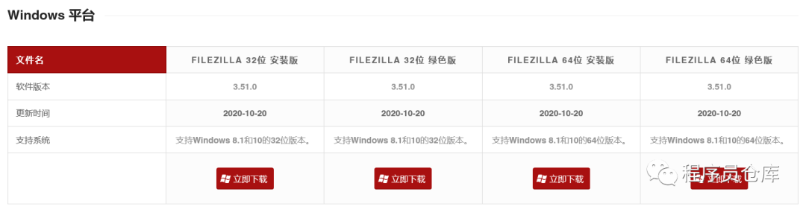
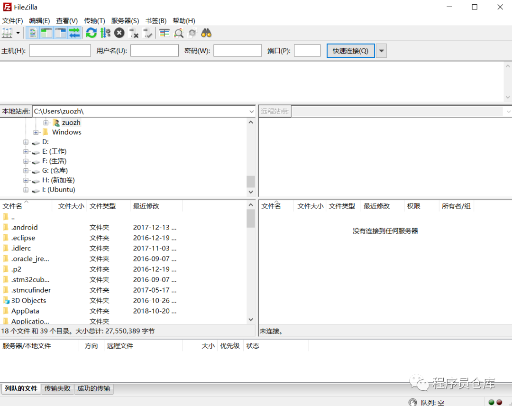
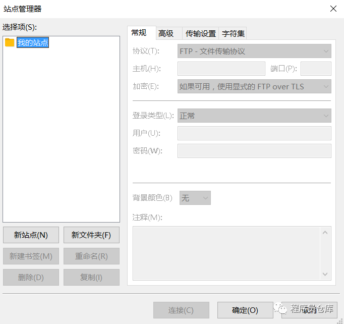
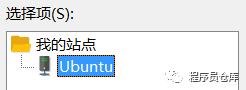
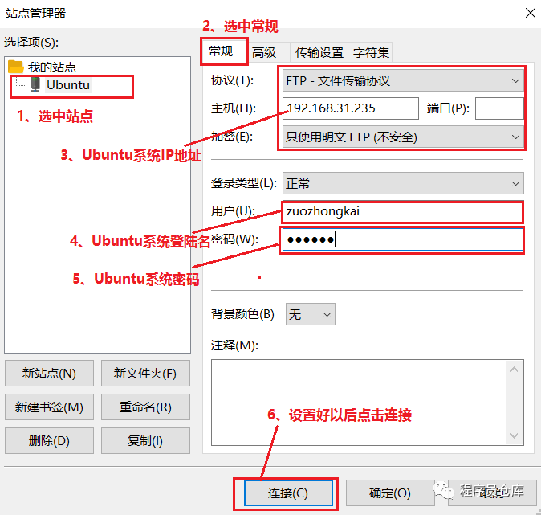
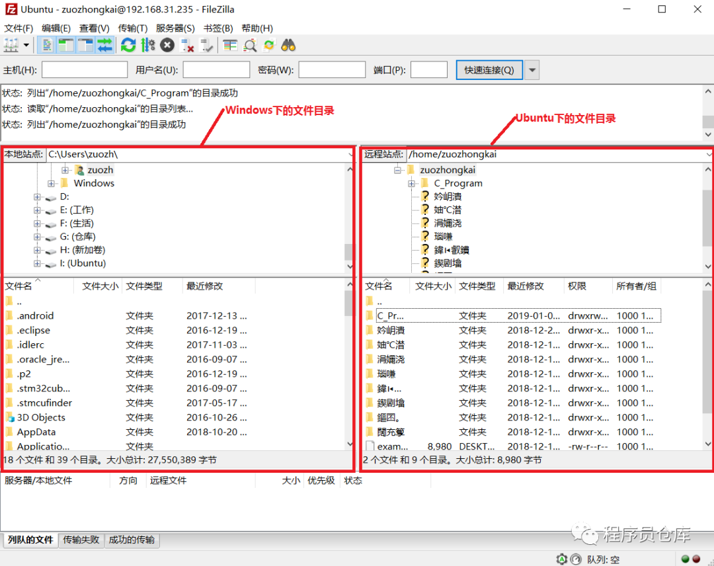
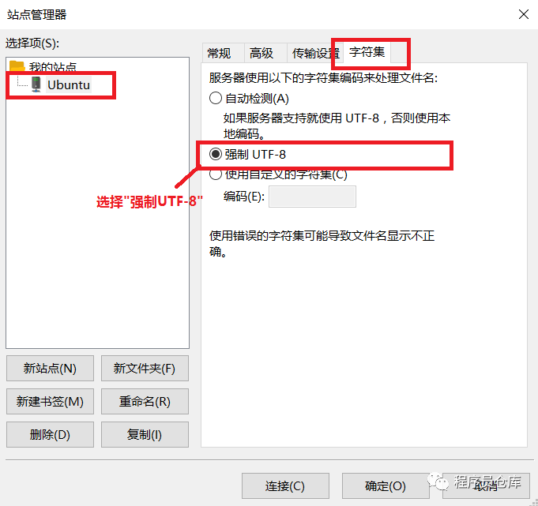

# Windows 与 Ubuntu 互传文件

最近买了一块正点原子的STM32MP157开发板，记录一下学习过程。今天总结一下 Window 与 Ubuntu 互传文件的方法。‍

在嵌入式开发中，通常会使用 Ubuntu 和 Windows 双系统联合开发的方式。Windows 系统用于编写代码，Ubuntu 系统用于代码编译。因此，在 Windows 和 Ubuntu 之间搭建文件传输通道是不可避免的。今天，我就来总结一下 FTP 文件传输通道的搭建方式。


## 1. Ubuntu 18.04 系统搭建 FTP 服务

首先，在 Ubuntu 中安装 FTP 服务，命令如下:

```bash
sudo apt-get install vsftpd
```

然后，修改`/etc/vsftpd.conf`文件（需要 sudo 权限），开启`local_enable`和`write_enable`。

```bash
sudo apt-get install vsftpd
```


修改完成后，保存退出。

最后，执行命令，重启 FTP 服务即可。

```bash
sudo /etc/init.d/vsftpd restart
```


FTP 服务安装完成后，还需要执行`ifconfig`命令获取 Ubuntu 系统的 IP 地址（Ubuntu 18.04 默认不再支持 `ifconfig`命令，需要先通过`sudo apt-get install net-tools`命令安装）。


## 2. Windows 安装 FTP 客户端

Windows 系统下可选的客户端很多，我使用的是：**FileZilla**。


### 2.1 客户端下载安装

从官网 https://www.filezilla.cn/download 下载客户端并安装。



如果使用的是 32 位系统，就下载 32 位版本；如果是 64 位系统，就下载 64 位版本。由于绿色版下载之后解压就可以直接使用，比较方便，所以我一般都是下载绿色版。

安装完成后，软件图标如图所示：


运行软件，界面如下图：




### 2.2 FileZilla 软件配置

（1）打开 FileZilla 软件，点击`文件`->`站点管理器`，打开后可以看到如下界面。



（2）点击`新站点`按钮创建站点，然后命名为 Ubuntu（名字可以随便取）。



（3）选中创建的 Ubuntu 站点，对`常规`选项卡进行配置。



连接成功后，界面如下：



（4）点击`服务器`->`断开连接`。

（5）点击`文件`->`站点管理器`，打开站点管理器。选中 Ubuntu 站点，然后选择`字符集`选项卡，配置为`强制 UTF-8`编码。（如果不配置编码，那么Ubuntu 系统的中文文件名会乱码）



（6）完成编码配置后，点击`连接`即可。

（7）如果要将 Windows 系统下的文件拷贝到 Ubuntu 系统，直接将左侧 Window 目录下的文件拖到右侧 Ubuntu 系统目录界面指定位置即可，反之亦然。


## 3. 总结

以上就是通过 FTP 服务在 Ubuntu 和 Windows 系统之间传递文件的方法。当然，如果你是用的是 VMware 虚拟机，那么在安装 VMware Tools 之后，直接在 Ubuntu 和 Windows 之间拖动文件也可以。
