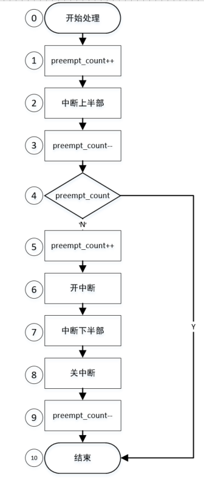
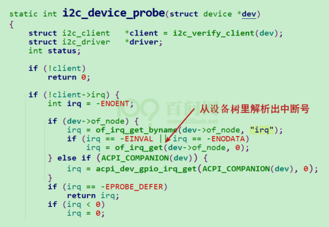
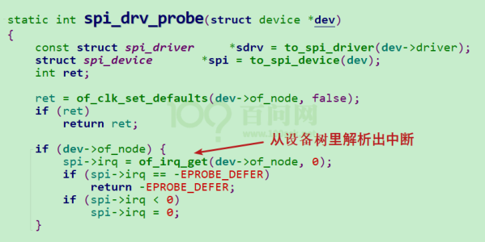

## 概念导入

中断就是停止现在正在做的事情去干另一件事情。

类比：母亲和睡觉的孩子

对比：轮询


## 处理流程

- 初始化
  - 中断源初始化
  - 中断控制器初始化
  - CPU 中断相关配置初始化
- 执行其他任务
- 中断发生，CPU 跳转到指定位置执行（延伸概念：中断向量）
- 从中断向量表跳转到中断处理统一入口函数，在该入口函数中完成以下工作：
  - 保存现场
  - 分辨具体中断源
  - 调用对应的中断处理函数
  - 恢复现场

> 疑问：从芯片设计角度，CPU 是如何感知到中断的？每执行一条指令后都去查询异常状态？


## 中断&进程&线程的核心：栈

**导入**：CPU 对内存只有读写指令。需要运算时，CPU 首先将数据从内存读取到 Rx 寄存器，然后使用 ALU 进行计算，将计算结果保存到 Rx 寄存器中，最后将计算结果从 Rx 寄存器拷贝到内存中。

**问题及解决**：当切换进程/线程/中断时，要保证把当前的 Rx 寄存器状态保存起来，所以需要将其保存到内存中。这类内存空间就是栈。


## 系统对中断处理的演进

Linux 操作系统中断处理的两个原则：

- 不能嵌套
  - 避免嵌套太多导致栈耗尽
- 处理的越快越好


对于耗时的中断处理，Linux 应对机制：

- 分为上/下半部
  - 上半部：处理紧急事务，不可被中断打断
  - 下半部：处理非紧急事务，可以被中断打断（延伸：下半部通过软中断机制实现）
- 用内核线程处理





中断场景分析：

- 只有 A 中断产生
- A 中断产生后，再次产生
- A 中断产生后，B 中断产生

> 基本理念：
>
> 1. 中断上半部执行过程中无法被新的中断打断
> 2. 中断下半部执行过程中可以被新的中断打断
> 3. 中断下半部的处理过程，会执行所有需要处理的中断下半部。
> 4. 中断下半部的处理可以分为如下几类：
>    1. 如果下半部任务简单，不太耗时，可以使用 tasklet 机制
>    2. 如果下半部任务耗时，则使用 work queue 机制。work queue 机制是在一个线程中处理所有的中断下半部任务。
>    3. 如果下半部任务耗时，还可以使用 thread_irq 机制。该机制是为每一个中断的下半部创建一个单独的线程，所以能够更好的利用多核资源。


## 中断的重要数据结构


### irq_desc 数组


### irqaction 结构体


### irq_data 结构体


### irq_domain 结构体


### irq_chip 结构体


## 设备树中指定中断

```
/ {
	intc: interrupt-controller@a0021000 {
		compatible = "arm,cortex-a7-gic";
		#interrupt-cells = <3>;
		interrupt-controller;
		reg = <0xa0021000 0x1000>,
		      <0xa0022000 0x2000>;
	};
	
	soc {
		interrupt-parent = <&intc>;
		adc: adc@48003000 {
			compatible = "st,stm32mp1-adc-core";
			reg = <0x48003000 0x400>;
			interrupts = <GIC_SPI 18 IRQ_TYPE_LEVEL_HIGH>,
				     <GIC_SPI 90 IRQ_TYPE_LEVEL_HIGH>;
			clocks = <&rcc ADC12>, <&rcc ADC12_K>;
			clock-names = "bus", "adc";
			interrupt-controller;
			st,syscfg = <&syscfg>;
			#interrupt-cells = <1>;
			#address-cells = <1>;
			#size-cells = <0>;
			status = "disabled";

			adc1: adc@0 {
				compatible = "st,stm32mp1-adc";
				#io-channel-cells = <1>;
				reg = <0x0>;
				interrupt-parent = <&adc>;
				interrupts = <0>;
				dmas = <&dmamux1 9 0x400 0x80000001>;
				dma-names = "rx";
				status = "disabled";
			};

			adc2: adc@100 {
				compatible = "st,stm32mp1-adc";
				#io-channel-cells = <1>;
				reg = <0x100>;
				interrupt-parent = <&adc>;
				interrupts = <1>;
				dmas = <&dmamux1 10 0x400 0x80000001>;
				dma-names = "rx";
				status = "disabled";
			};
		};
	}
	
}
```

设备树中常用的中断相关属性：

```
interrupt-controller;
interrupt-cells = <x>;
interrupt-parent = <&xxx>;
interrupts = <xx>;
interrupts-extended = <&xxx xx>;
interrupt-names = "xxx";
```

interrupt-parent 和 interrupts 属性可以用 interrupts-extended 代替，例如：

```
interrupt-parent = <&adc>;
interrupts = <0>;

可以改写为：
interrupts-extended = <&adc 0>;
```

> 扩展：
>
> 在 ARM 架构下，常提到 PPI (Private Peripheral Interrupt) 、SPI (Shared Peripheral Interrupt)、SGI (Software-generated interrup) 中断类型。
>
> PPI 表示该中断时某个 CPU 核独占的；
>
> SPI 表示该中断被多个 CPU 核共享；
>
> SGI 表示该中断是由软件触发的，被用于不同 CPU 核之间通信；


## 代码中获取中断

- 对于 platform device

```C
platform_get_reource();
```

- I2C 设备

  在 I2C 总线驱动（`drivers/i2c/i2c-core.c`）中，I2C 设备会被转换成一个`i2c_client`结构体，中断号会保存在`i2c_client`的`irq`成员里。

  

- SPI 设备

  在 SPI 总线驱动（`drivers/spi/spi.c`）中，SPI 设备会被转换成一个`spi_device`结构体，中断号会保存在`spi_device`的`irq`成员里。

  

- GPIO

  ```C
  // 首先获取GPIO引脚和flag
  button->gpio = of_get_gpio_flags(pp, 0, &flags);
  bdata->gpiod = gpio_to_desc(button->gpio);
  
  // 然后，获取中断号
  irq = gpiod_to_irq(bdata->gpiod);
  
  // 也可以用 gpio_to_irq()
  ```

- 其它

  ```C
  of_irq_get();
  ```


## 参考资料

1. 百问网课程《驱动大全》
2. 
