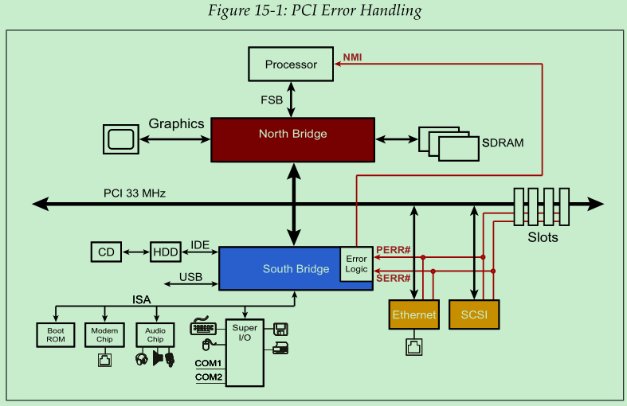

## 背景

PCIe 一个很大的特点就是软件兼容 PCI，所以在 PCIe 配置空间（configuration space）中保留了 PCI 的寄存器。 

在 PCI 协议中，当传输过程中检测到错误时，设备会首先更新配置空间中的 Status Register，然后根据错误类型使用`PERR#`或者`SERR#`信号向总线上的其他设备报告错误情况。`PERR#`（Parity Error）代表数据传输过程中出现了校验错误，通常可以恢复的。`SERR#`（System Error）代表无法恢复的严重错误。这两种类型的错误可以按照如下归类：

- 普通的数据校验错误 -- 使用`PERR#`信号
- 多任务事务传输时发生的数据校验错误 -- 使用`SERR#`信号
- 地址或命令校验出错 -- 使用`SERR#`信号
- 其他类型错误（设备相关）-- 使用`SERR#`信号

错误的处理方式可能包含硬件或者软件。例如，读取内存的时候发生数据校验错误，那么在确定内存数据没有因为这次失败的访问而导致损坏的前提下，硬件在发现错误之后重新读一次就可以了。

从上图中可以看出，所有 PCI 设备的`PERR#`和`SERR#`信号都被接到了南桥上，然后南桥通过 NMI (Non-Maskable Interrupt) 通知将错误情况通知 CPU。早期的消费级电脑上没有投入太多的成本在这类的错误处理上，所以在受到错误通知后，系统直接停止并进入蓝屏界面（BSOD，Blue Screen Of Death）。

PCI-X 总线也是使用`PERR#`和`SERR#`信号，但它根据设备特定的错误处理程序是否存在，制定了对应的错误处理规则。如果没有对应的错误处理程序，那么所有的校验错误都会使用`SERR#`信号上报。

后来的 PCI-X 2.0 主要面向企业级应用场景。这些场景下的硬件资源更丰富，所以 PCI-X 2.0 协议开始支持ECC（Error-Correcting Code）校验。通过ECC，硬件可以在传输过程中自动纠正1 bit的错误。

最后，PCIe 协议为了兼容 PCI 和 PCI-X 协议，在配置空间中保留的错误状态位（Error Status Bit）。所以，基于 PCI 或者 PCI-X 的传统软件也能在不修改的情况下，操作 PCIe 设备。

## 错误定义

协议中定义了四个通用名词：

- Error Detection：即判定错误是否存在的过程。对于设备来说，发现错误是一个内部事件，例如接收到了一个坏的数据包，或者从另一个设备收到了一个标记着错误的数据包（例如 poisoned packet）。
- Error Logging：根据检测到的错误类型，设置设备配置空间中对应的寄存器，以便于错误处理程序之后使用。
- Error Reporting：向系统发出通知，告诉它：”现在出错了“。在使能了 Error Message 发送功能的情况下，设备检测到错误之后，向 Root Complex 发送Error Message，Root Complex 接收到 Error Message 之后，向系统（CPU）发出中断。 
- Error Signaling：一个设备向另一个设备告知”错误“的过程，可以通过以下方式：
  - 发送 Error Message
  - 发送一个 Completion 包，并把它的状态设置为 UR（Unsupported Request）或者 CA（Completer Abort）
  - 发送一个污染的 TLP（poisoning a TLP），通常这种方法被称为错误转发（Error Forwarding）。

## 错误报告（Error Reporting）

PCIe 有两个层级的错误报告机制，一种是基础错误报告（baseline error report），是所有设备都必须支持的，另一种是高级错误报告（AER，Advanced Error Report），不强制要求支持。高级错误处理（AER）通过配置空间中的 Advanced Error Reporting Capability 提供了一组寄存器，记录了更多的错误细节。

### 基础错误报告

与基础错误报告机制相关的寄存器有两组：

- PCI-Compatible Register：这组寄存器是用来与 PCI 协议进行兼容的。PCIe 错误会被映射为 PCI-compatible 类型的错误，供传统的 PCI 程序使用。
- PCI Express Capability Registers：这组寄存器是 PCIe 协议特有的，可以提供更多的错误相关信息。

### 高级错误报告（AER）

AER 机制提供了更多的错误相关信息，与该机制相关的寄存器保存在配置空间的 Extended Configuration Space 部分。

## 错误类型

根据“错误能否被硬件纠正”，可以将错误分为 Correctable 和 Uncorrectable。对于 Uncorrectable 类型的错误，根据“能否被软件修复”，可以再被细分为 Non-fatal 和 Fatal。

- Correctable errors：能够被硬件自动修复
- Uncorrectable errors：无法被硬件自动修复
  - Non-fatal：由设备相关的软件处理，此时链路正常，有可能在不丢失数据的情况下修复。
  - Fatal：由系统软件处理，此时链路或者设备无法正常工作，基本不可能在不丢失数据的情况下修复。

不同的错误类型，软件可以参与不同的应对策略。对于 Correctable Errors，软件可能只需要记录发生的频率；对于 Fatal Error，可能需要复位整个系统。

 

### Correctable Errors

Correctable Errors 是指那些可以被硬件自动纠正的错误。这类错误可能会损耗一些传输带宽，但其纠正的过程完全不需要软件参与，并且不会造成数据丢失。

软件可以不关心 Correctable Errors，但通过跟踪 Correctable Errors 发生的趋势可以提前预判设备即将出现的故障（设备在出现比较严重的故障之前，可能会先出现越来越多的 Correctable Errror）。

### Uncorrectable Errors

Uncorrectable Errors 是指不能被硬件自动纠正的错误。

#### Non-fatal Uncorrectable Errors

Non-fatal Errors 表示有信息丢失了，但并不是由于链路完整性或者设备完整性引起的。某一个包丢失了，但链路能正常工作，其它数据包还在继续正常传输。既然链路能正常工作，那也就有办法恢复已经丢失的数据，不过具体的实现方案依赖于具体的软件实现。

Non-fatal error 的一个例子就是 completion timeout：设备发出了一个请求，但是在规定时间之内没有收到对应的 completion。这种错误的应对方案也很简单，只要重新再发一遍请求即可。

#### Fatal Uncorrectable Errors

Fatal Errors 是指由于链路或者设备问题导致了数据丢失，而且很难把丢失的数据进行恢复。出现这种问题时，链路或者设备通常已经不能正常工作了，所以需要先对链路或者设备进行复位，复位之后，软件可以根据自身需求做出其它所需的操作。

Fatal error 的一个例子就是 receiver buffer overflow，这种错误是由于流控（flow control）信息同步异常导致的。由于没有特定的机制用于修复该错误，所以只能对链路进行复位。

## 错误检测机制

PCIe 的错误检测主要是针对链路和数据包传输过程的。与链路和数据包传输过程无关的错误不能通过 PCIe 错误检测机制的报告出来，这类错误需要借助其它的方式进行报告，例如设备特定的中断等等。

PCIe 传输的每一层（Layer）都有对应的错误检测方式，这些内容会在接下来的章节进行详细介绍。

### CRC

鉴于 CRC (Cyclic Redundancy Check)  是 PCIe 错误检测机制的重要部分，此处先对 CRC 做一个简单介绍。

CRC 的原理很简单：数据的发送方在发送之前先基于要发送的数据包生成一个 CRC 校验值，然后把这个校验值和数据包一起发送出去。接收方在收到数据包之后，基于收到的数据包再生成一个 CRC 校验值，然后和发送方生成的校验值做比较。如果两个校验值不一样，那就表明这个数据包出错了。

在 PCIe 中，对 CRC 的使用分为 LCRC 和 ECRC 两种。

- LCRC（Link CRC）：LCRC 是每个 PCIe 设备必须支持的，它工作于数据链路层（Data Link Layer），用于保护每个通过数据链路层发送/接收的 TLP。它的目的就是为了发现数据在连路上传输时出现的错误。
- ECRC（End-to-End CRC）：ECRC 的支持是可选的，它工作于事务层（Transaction Layer）。数据发送方的事务层生成 ECRC，数据最终的接收方的事务层使用 ECRC 进行校验。使用 ECRC 可以发现一些 LCRC 无法发现的错误。

为了便于理解 LCRC 和 ECRC 存在的位置，我们看一张图：

从发送（Transmit）的角度看，ECRC 是在事务层（Transaction Layer）生成的，用于保护 Data Payload；LCRC 是在数据链路层（Data Link Layer）生成的，用于保护 TLP。

从接收（Receive）的角度看，LCRC 是在数据链路层（Data Link Layer）被使用的，用完之后在数据链路层就丢弃了。ECRC 是在事务层（Transaction Layer）使用的，用完之后也被丢弃了。

在已经存在 LCRC 机制的情况下，PCIe 又推出了 ECRC，那么说明 ECRC 能做到一些 LCRC 做不到的事情。接线来我们探讨一下 ECRC 的出现是为了解决哪种问题。

以上图为例，PCIe Endpoint 向 Root Complex 发送一个数据包，我们看看有没有 ECRC 参与的情况下，会有哪些差别。

在没有 ECRC 的情况下，数据包在 PCIe Endpoint 的事务层没有添加任何保护，在数据链路层生成 LCRC 后将数据发出。Switch 的下游端口（downstream port）接收到数据包之后，在它的数据链路层进行 LCRC 校验，然后将 PCIe Endpoint 发过来的 LCRC 值丢弃。之后，Switch 通过上游端口（upstream port）的数据链路层生成新的 LCRC，将数据发送给 Root Complex。Root Complex 收到数据后，基于 Switch 上游端口（upstream port）生成的 LCRC 值进行校验，判定数据是否存在错误。

上面的流程中，在 Switch 内部，下游端口会拿掉 LCRC，然后在上游端口重新生成 LCRC。如果在这个过程中数据包的内容发生了改变，那么上游端口就会基于改变后的数据包生成新的 LCRC。这种情况下， Root Complex 接收到数据包之后是无法发现数据包在 Switch 内部已经发生改变的。

加入 ECRC 之后，在发送端的事务层就会生成 ECRC 值，并将其包含在 TLP 中。在 Switch 中，无论是下游端口（downstream port）还是上游端口（upstream port），都不会使用这个数据包中 ECRC，因为它们不是这个 TLP 的最终接收方。Switch 会将完整的 TLP 从下游端口转发至上游端口，在上游端口添加 LCRC 后发送给 Root Complex。如果在 Switch 内部 TLP 发生了改变，那么 Root Complex 的事务层（Transaction Layer）使用 ECRC 对该 TLP 进行校验的时候，就会发现 TLP 的内容与该 TLP 中的 ECRC 值对应不起来，从而判定数据出错。

### 分层的错误检测

#### 物理层错误

从接收的角度看，PCIe 数据包首先进入接收设备的物理层。物理层所涉及的错误包含以下几个方面：

- When using 8b/10b, checking for decode violations (checking required)
- Framing violations (optional for 8b/10b, required for 128b/130b)
- Elastic buffer errors (checking optional)
- Loss of symbol lock or Lane deskew (checking optional)

如果在 TLP 的处理过程中发生了物理层错误，那么该 TLP 会被丢弃。为了解决这个错误，数据链路层会向对端发一个 NAK。

#### 数据链路层错误

从接收的角度看，PCIe 数据包在经过物理层之后，被发送到数据链路层。数据链路层涉及到的错误有：

- LCRC failure for TLPs
- Sequence Number violation for TLPs
- 16‐bit CRC failure for DLLPs
- Link Layer Protocol errors

从发送的角度看，数据链路层也涉及到一些错误，包括 REPLAY_TIMER 超时和 RELAY_NUM counter rolling over。 

#### 事务层错误

事务层与接收有关的错误有：

- ECRC failure (checking optional)
- Malformed TLP (error in packet format)
- Flow Control Protocol violation
- Unsupported Requests
- Data Corruption (poisoned packet)
- Completer Abort (checking optional)
- Receiver Overflow (checking optional)

事务层与发送有关的错误有：

- Completion Timeouts
- Unexpected Completion (Completion does not match pending Request)

## 错误污染

错误污染（Error Pollution）是指针对同一个传输事务报告了多个错误。例如，设备接收到一个数据包时，在物理层已经检测到错误了，那么把这个数据包传给数据链路层和事务层之后，肯定还会在数据链路层和事务层的检测出错误，但物理层、数据链路层和事务层的这些错误都是同一个数据包引起的。

错误污染（Error Pollution）会引发问题，所以 PCIe 协议做了针对性的约定：只报告最关键的错误。也就是说，如果在物理层已经发现错误了，那就再物理层报告对应的错误，然后直接把这个数据包丢掉，不要再往物理层和数据链路层转发了。

有了上面的约定之后，我们还面临一个问题：同一个数据包，只在事务层就可能满足多种错误的报告条件。例如，一个 TLP 的 Header 部分出错，那么它既可以触发 ECRC 校验错误，也可以触发 Malformed TLP 错误，也可以触发 Unsupported Request 错误。为了解决这个问题，PCIe 协议对事务层的错误类型指定了优先级，对于错误的数据包，只报告优先级最高的错误类型。事务层各类错误的优先级由高到低排布如下：

- Uncorrectable Internal Error
- Receiver Buffer Overflow
- Flow Control Protocol Error
- ECRC Check Failed
- Malformed TLP
- AtomicOp Egress Blocked
- TLP Prefix Blocked
- ACS (Access Control Services) Violation
- MC (Multi‐cast) Blocked TLP
- UR (Unsupported Request), CA (Completer Abort), or Unexpected Completion
- Poisoned TLP Received

## 错误来源

#### ECRC 生成与检测

ECRC 生成和检测需要依赖配置空间（Configuration Space）中的 AER（Advanced Error Reporting） 寄存器结构。

软件通过查询配置空间的寄存器，确认当前 PCIe Function 是否支持 AER。如果支持，那么可以通过更改 Error Capability 和 Control Register 的值来使能 ECRC 的生成与检测。

使能了 ECRC 功能之后，设备在生成 TLP （Request 或者 Completion）时，会根据 Header 和 Data Payload 的值计算出一个 32 为的 ECRC 值，并把它放在 TLP 的末尾。

ECRC 之所以被称之为 End-to-End，是因为 ECRC 由数据的发送端设备生成，在传输过程中不会被丢掉或者重新生成，只有到达最终的目标接收设备后，该 TLP 的 ECRC 才会在被用完后丢弃。如果有必要，Switch 可以对基于 TLP 中的 ECRC 对 TLP 进行校验，但无论校验是否通过，它都必须把 TLP 原封不动的发送给这个 TLP 的最终目标设备。

##### TLP Digest

如果使能了 ECRC，那么在 TLP 的 header 中有一个名为 TD（TLP Digest）的特殊位，这个位被设置为 1 时，表明该 TLP 的末端包含了 ECRC 值。

TLP Digest 非常重要，如果在传输过程中 TD 发生改变，那接收者就无法按照正确的格式解析该 TLP，最终将其判定为 Malformed。

##### Variant Bits Not Included in ECRC Mechanism

ECRC 的值是基于 TLP 中的 Header 和 Data Payload 部分计算出来的，所以这两个部分的值在传输过程中不应该发生改变，但是现实是 Header 中 Type 部分的 bit 0 和 EP 位都有可能发生改变。

首先是 Type 部分的 bit 0：对于配置请求（Configuration Request），在到达该请求的目标设备所在的总线之前，它的 Type 部分的 bit 0 的值是 1，到达目标设备所在的总线之后，其值变为 0。

其次是 EP 位：在传输过程中，如果某个设备发现传输的数据包有错误，那么他就会将该数据包的 EP 位设置为 1。通过修改 EP 位可以告知接收设备其收到的数据包存在错误。

因为 Header 中 Type 部分的 bit 0 和 EP 位在传输过程中可能会发生改变，所以将其称之为 variant bits，而且不能被用于生成 ECRC 值。在生成 ECRC 或者使用 ECRC 进行校验的时候，无论 Header 中 Type 部分的 bit 0 和 EP 位的实际值是多少，我们都把他们当做 1。这样，ECRC 的生成和校验都不会收到 Type 部分的 bit 0 和 EP 位改变的影响。

ECRC 校验出错的时候，我们可以根据出错的数据包是 Request 还是 Completion，采取不同的应对策略：

- Request 的 ECRC 校验出错：Completers（接收到 request 的设备）如果发现接收到的 Request 有 ECRC 错误，必须将 ECRC error status 位设置为 1。与此同时，它们也可以不对该 request 返回 completion，这样就会触发 request 发送设备的 completion timeout，发送设备的软件可以重新把 request 发送一次。
- Completion 的 ECRC 校验出错：requester（发送 request 的设备）发现收到的 completion 中有 ECRC 错误后，必须将 ECRC error   status 位设置为 1。除了标准的错误报告机制之外，requester 还可以选择通过设备特定的中断将该错误报告给软件（需要 requester 的硬件支持），然后软件重新发送 request。

无论 ECRC 错误出现在 request 还是 completion，都可以给系统发送一个 Uncorrectable Non‐fatal error Message，然后驱动软件通过查询 Uncorrectable Error Status Register 获取更多错误相关信息。

#### Data Poisoning

Data poisoning，也被称为 Error Forwarding，提供了一种标记当前 TLP 存在错误的方法。当设备发现某个 TLP 中的数据存在错误时，就把这个 TLP 的 EP 位设置为 1，这样，所有接收到这个 TLP 的设备都能知道当前这个 TLP 的数据有错误，从而做出对应的处理。

注意，data poisoning 机制的作用对象是 TLP 中所包含的数据，而不是 TLP 的 header 部分。除了 Memory、Configuration、I/O writes 和 completion 这种可以携带数据的 TLP 类型之外，其他类型的 TLP 都不能使用 data poisoning 机制。如果设备接收到的 TLP 中 EP 位被设置为 1，但这个 TLP 却不包含数据，那么该设备可能会做出预料之外的未定义操作。

通过设置配置空间的 Command register 的 Parity Error Response 位，可以使能 data poisoning 功能。

接收到 EP 位为 1 的 TLP 之后，可以通过 error message 告知系统。如果有 AER，那么也会配置 AER 中对应的 Poisoned TLP status 位。

## 错误的报告方式

PCIe 支持的错误报告方式有以下几种：

- Completions — Completion Status reports errors back to the Requester
- Poisoned Packet — reports bad data in a TLP to the receiver
- Error Message — reports errors to the host (software)

### Error Message

PCIe 消除了 PCI 协议中使用的边带信号，使用 Error Message 的方式代替。相对于`PERR#`和`SERR#`信号，Error Message 可以提供更多的错误信息。

Error Message 的格式如下：

需要注意的是，Error Message 最终都是发送到 Root Complex 进行处理的。Message Code 表明了错类型，有三种可取值：

 

#### Advisory Non-Fatal Errors

#### Advisory Non-Fatal Cases

## 基础错误的检查与处理

## 高级错误报告（AER）

## 错误记录及报告的总结

## 软件错误处理流程示例