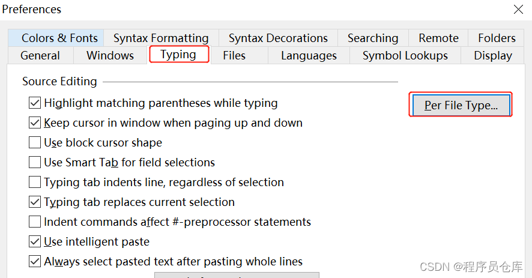
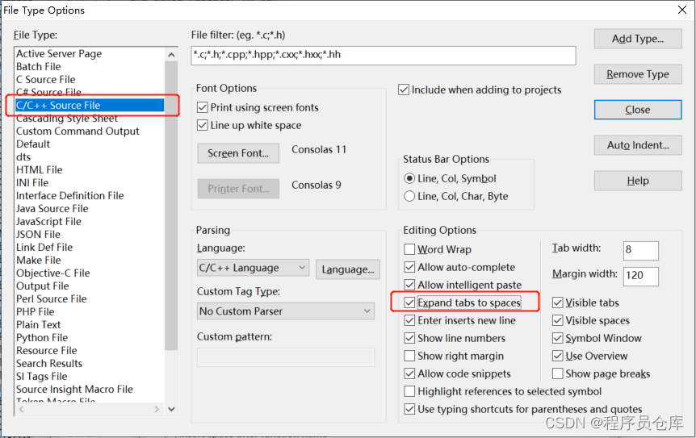

# Source Insight 4.0 配置将tab自动替换为空格

有些公司会要求代码中不允许使用`tab`，所有的缩进或者对齐都必须使用空格，但是都手动敲空格太麻烦，这时可以通过配置使 SI4.0 自动将我们输入的`tab`转换为空格。

首先，选择`Options` -> `Preferences`：

然后，在弹出的对话框中依次选择`Typing` -> `Per File Type`：

第三，在`File Type`中选择要设置的文件类型，然后在右侧勾选`Expand tabs to spaces`，设置完成后按“回车”确认即可。

