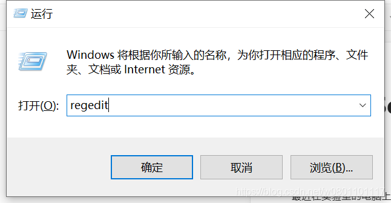

最近在实验室的电脑上调试硬件需要用到串口，于是就下载了一份绿色版 SecureCRT 6.5.0，结果运行的时候报错：

> SecureCRT 遇到一个致命的错误且必须关闭。一个崩溃转储文件已创建于 C:\Users\xxx\AppData\Roaming\SecurCRT.dmp

查了一些资料，发现这个问题可能是因为之前这台电脑上安装过 SecureCRT，被删除之后遗留了一些东西导致的，所以需要把这些残留删除。
删除步骤：
首先，进入 C:\Users\xxx\AppData\Roaming\ 目录，删除掉 SecureCRT.dmp 文件以及 Vandyke 文件夹。
然后，通过键盘上的 win键 + R 键 调用系统的运行面板，输入 regedit 启动注册表管理器。

在注册表中，查看一下几个位置是否包含 VanDyke 字样的内容，如果包含，则删除：

- HKEY_LOCAL_MACHINE\SOFTWARE
- HKEY_CURRENT_USER\SOFTWARE\
- HKEY_LOCAL_MACHINE\SOFTWARE\Wow6432Node\

删除之后，运行 SecureCRT 绿色版，一切正常。
