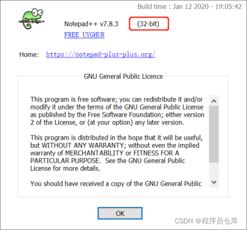
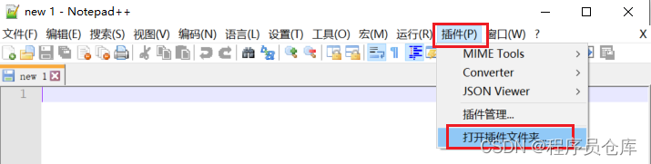
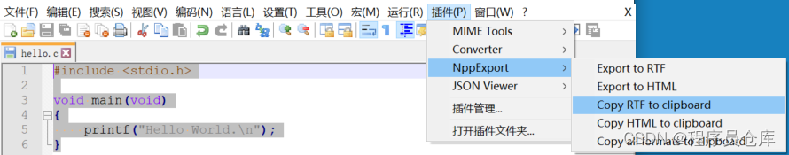
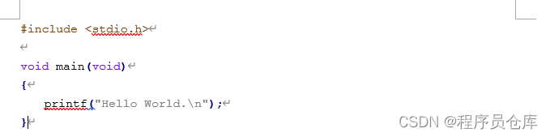
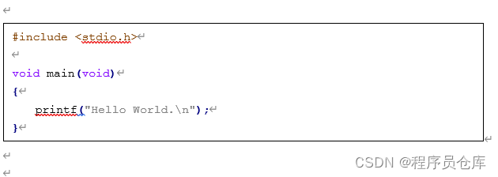

# Word中插入高亮代码_Notepad++

作为程序猿，我们在写文档的时候难免需要插入一些代码。借助 Notepad++ 的插件，可以让我们在 Word 文档中插入的代码自带语法高亮，从而更加美观易读。

1. 打开 Notepad++，按`F1`键，确认你的 Notepad++ 是 32 位还是 64 位的。

2. 从 NppExport 插件的 Github (https://github.com/chcg/NPP_ExportPlugin/releases)下载对应的压缩包。如果 Github 太卡，也可以直接下载我上传的版本（https://download.csdn.net/download/w0801101117/72338916）。

3. 打开 Notepad++，依次选择`插件`->`打开插件文件夹`。在弹出的文件夹中，创建 NppExport 文件夹，并把下载的 NppExport.dll 文件放到该文件夹中。

4. 重启 Notepad++，即可完成插件安装。

5. 使用 Notepad++ 打开代码文件，并选中要插入到 Word 文档中的代码，然后选择`插件`->`NppExport`->`Copy RTF to clipboard`

   

6. 在 Word 文档中选择`粘贴（Ctrl + V）`，即可将高亮代码插入文档，效果如下：

   

   为了文档美观，可以先在 Word 中插入一个文本框，然后将代码粘贴到文本框中，效果如下：

   

**优点：**

（1）Notepad++ 比较轻量级，操作方便。

（2）插件安装简单。

**缺点：**

（1）插入的代码无法带行号。

（2）Notepad++ 的语法高亮比较简单，不如 vscode 的色彩艳丽。