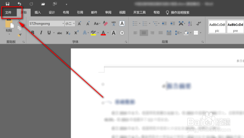
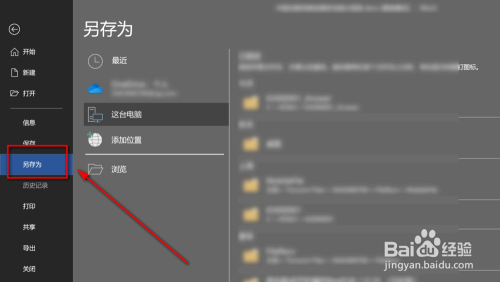
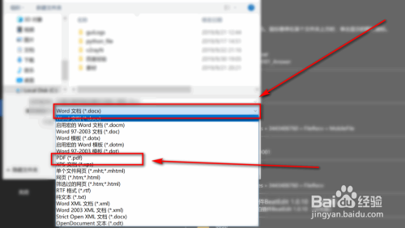
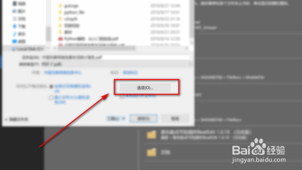
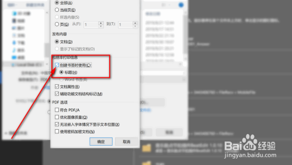
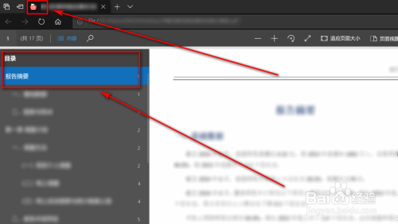

# Word文件保存为PDF并生成目录书签

## 声明

该内容是转载。

[Word自带转换为PDF同时生成目录书签-百度经验 (baidu.com)](https://jingyan.baidu.com/article/aa6a2c140137a34d4d19c43f.html)

## 需求

已有 Word 文档，要转换成 PDF 文件，要求根据 Word 文档的标题生成 PDF 文件的目录书签。

## 步骤

- 首先打开需要转换的Word文件，然后点击左上角的“文件”

  

- 选择“另存为”

  

- 点击“Word文档（\*docx）”在下拉列表里选择“PDF（\*pdf）”

  

- 然后点击“选项”

  

- 勾选“创建书签时使用”

  

- 此时在你保存的位置就会生成一个带有目录书签的pdf文件

  