## 1. 背景

之前一直用 VMware 虚拟机或者 Docker 容器进行嵌入式 Linux 学习，最近想试试 Win10 的 Linux 子系统 WSL2。相较于虚拟机和 Docker 容器来说，WSL2 应该还是有不少坑的，不过在最近的实践中，搭建百问网的IMX6ULL 开发板编译环境算是比较顺利，u-boot 和 kernel 都能顺利编译、运行。

驱动开发过程中，NFS 功能可以算得上是利器了，但是 WSL2 不支持（或者是我不会弄...），所以退而求其次，直接用 Win10 搭建 NFS server。


## 2. 工具：haneWIN

haneWIN 是 Win10 下搭建 NFS server 的常用工具，官网是`https://www.hanewin.net/imprint-e.htm`，当然，也可以搜索一些和谐版来用。


### 2.1 软件运行与配置

使用管理员权限运行 haneWIN 后，大家就能看到一个非常简朴的界面，具体的配置就不详细解释了，直接给大家截图看看我的配置：

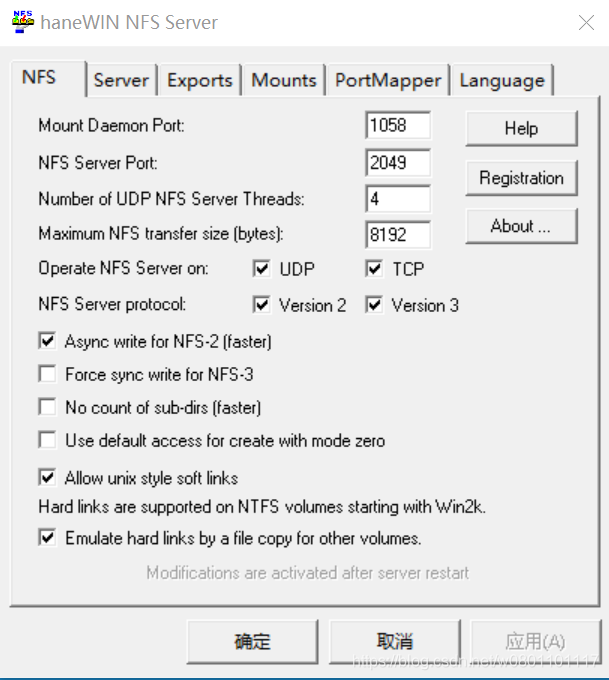
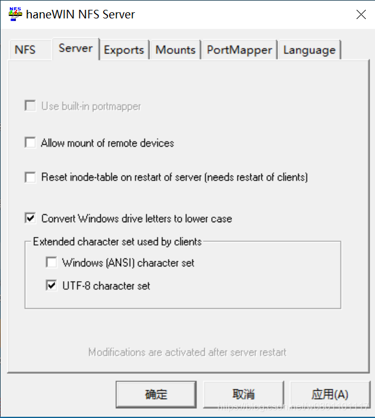
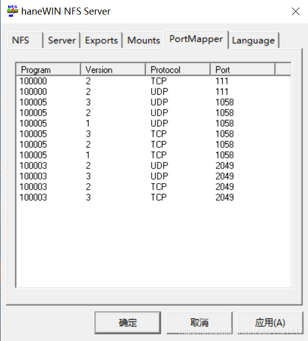
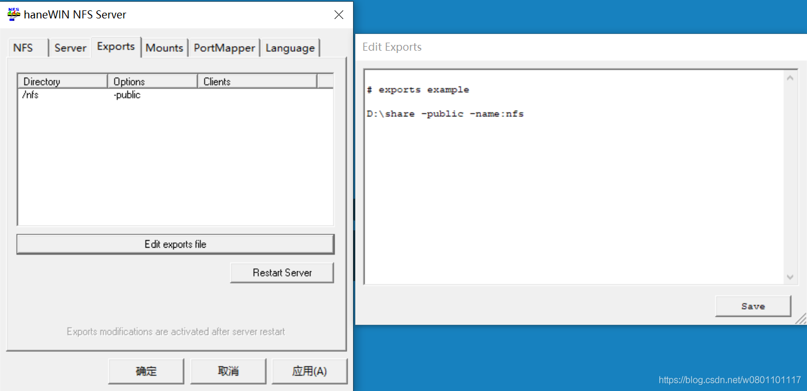


比较关键的配置是`Exports`，点击`Edit export file`，按照格式配置要共享的目录：

```
D:\share -public -name:nfs
```

我现在是把`D:\share`文件夹共享，权限设置为`pubic`，定义了一个别名`nfs`。

配置完成后，点击`Restart Server`重启服务，使新的配置生效。


### 2.2 防火墙配置

从`PortMapper`界面中可以看出，haneWIN 使用的端口如下：

- TCP：111, 1058, 2049
- UDP：111, 1058, 2049

因此，需要对 Win10 的防火墙进行配置，开放这些端口才能实现 NFS 挂载。（当然，更简单的办法是直接把防火墙关掉...）

- 第1步，打开控制面板，选择`Windows Defender防火墙`

  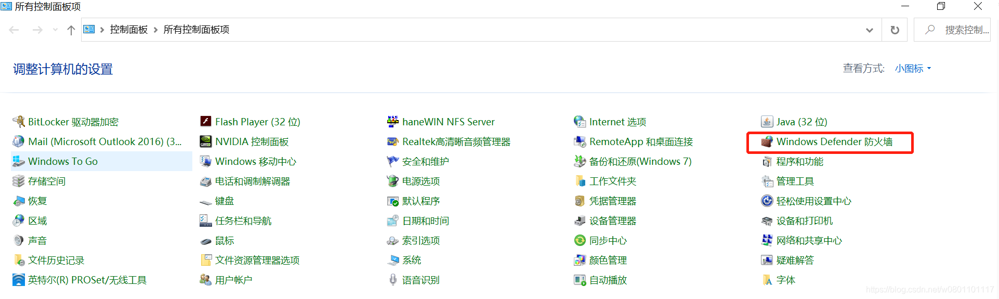


- 第2步，选择`高级设置`->`入站规则`->`新建规则`

  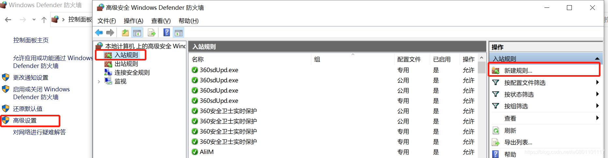


- 第3步，选择`端口`->`下一步`

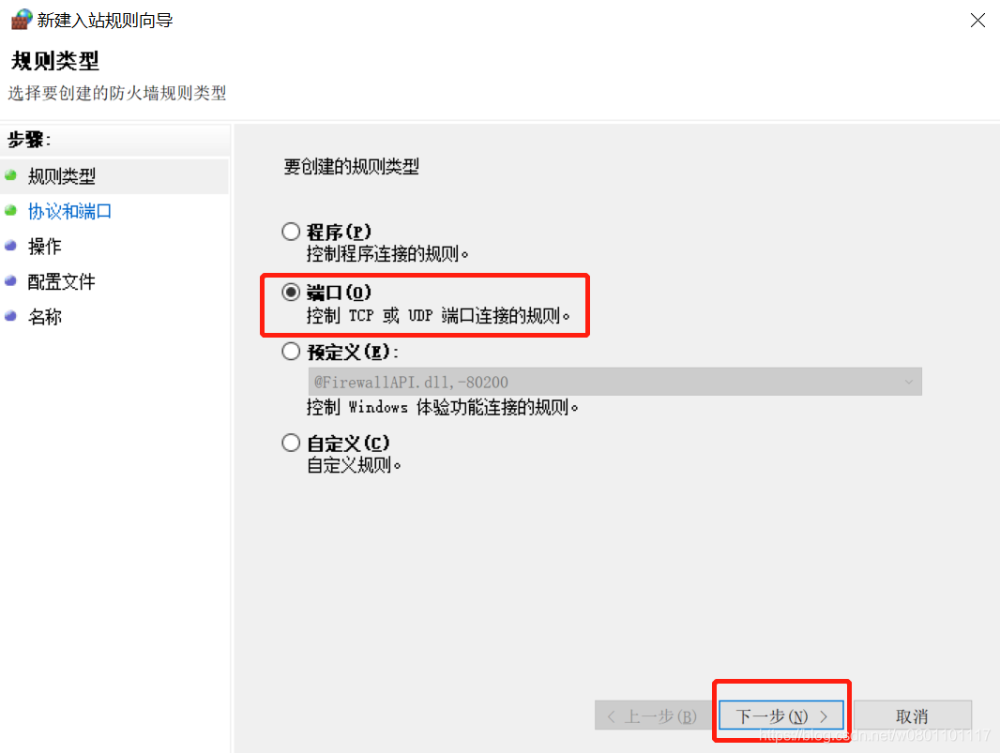


- 第4步，选择`TCP`->`特定本地端口`，添加`111,1058,2049`

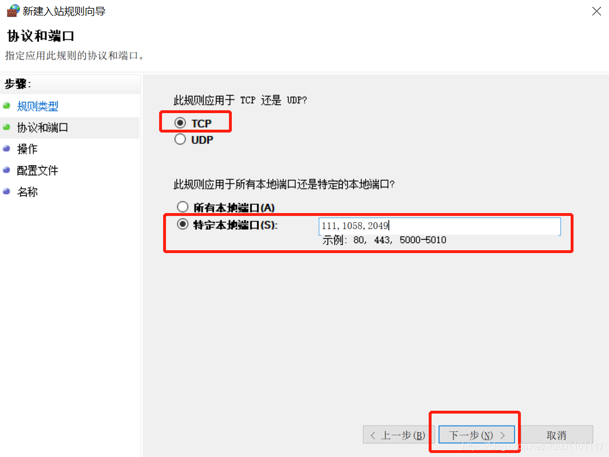


- 第5步，选择`允许连接`

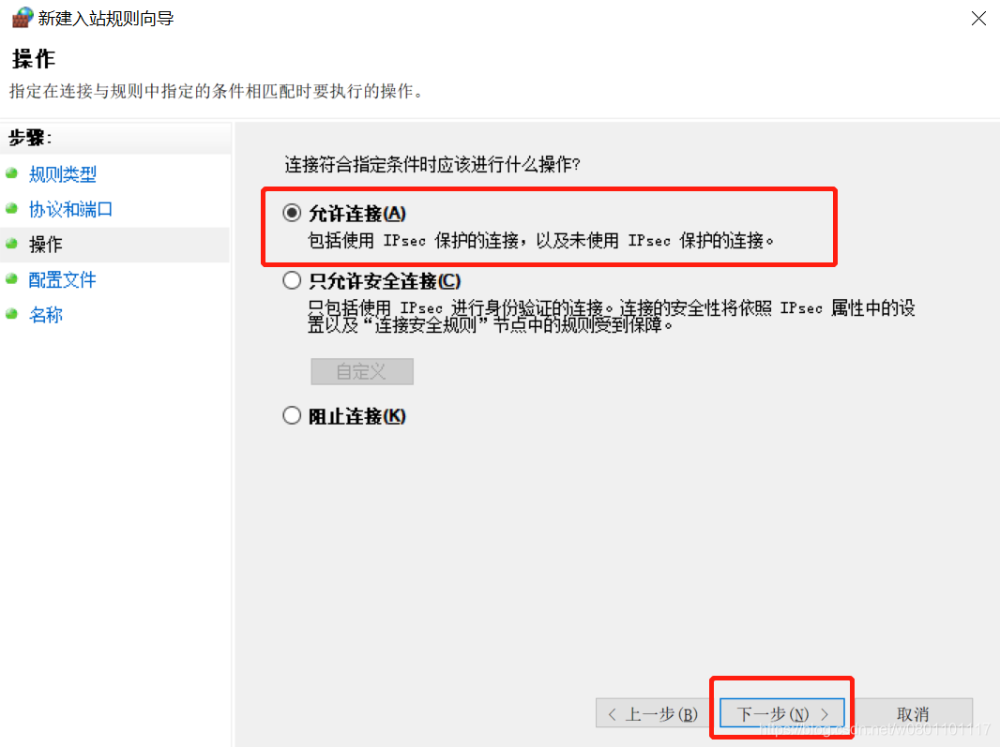


- 第6步，勾选`域`、`专用`、`共用`

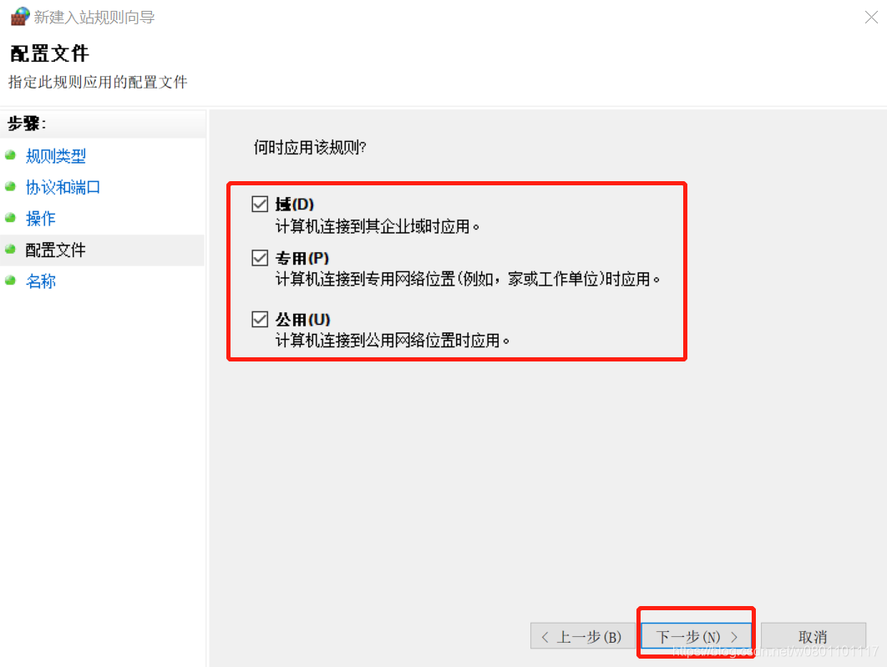


- 第7步，为该规则定义一个名字，点击`完成`

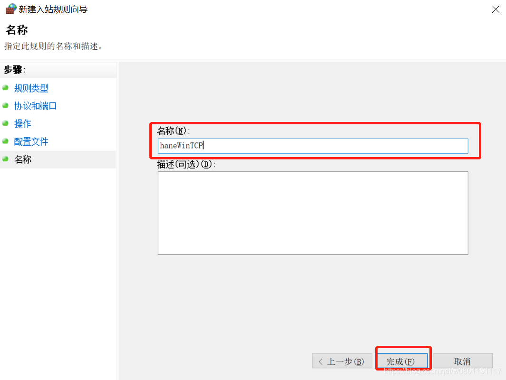


- 第8步，仿照刚才TCP端口规则的建立过程，再创建一条UDP端口规则。

  

## 3. 挂载

启动开发板Linux系统，执行命令挂载目录：

```
mount -t nfs -o nolock 192.168.100.200:/nfs /mnt
```

> 192.168.100.200是Win10系统的IP地址；
>
> nfs是之前`Edit export file`时为目录创建的别名
>
> /mnt是指定将远程目录挂载到本地的/mnt目录下。

我手上有两个开发板，一个百问网的 IMX6ULL 开发板，一个是 Xilinx ZYNQ 7100 开发板，比较奇怪的是，IMX6ULL 只有在 Win10 关闭防火墙的时候才能挂载上，而 ZYNQ7100 开发板只需要添加入栈规则就可以，这个问题以后再深究。
