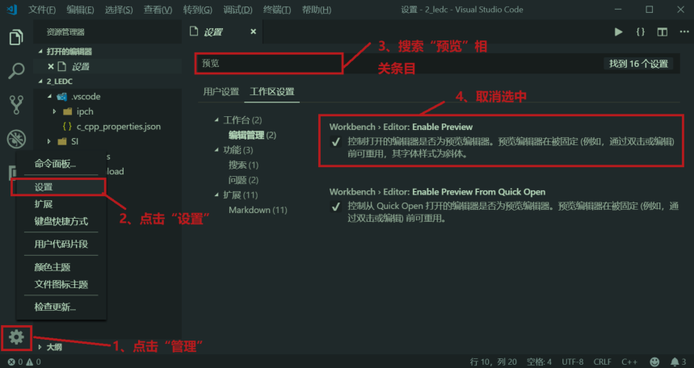
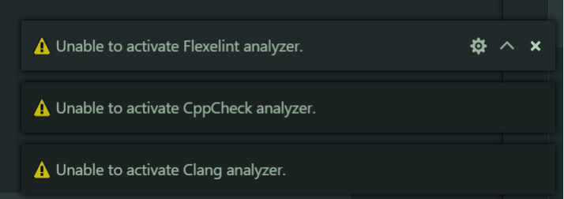
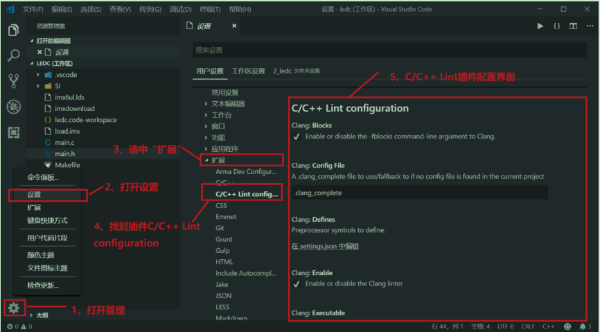
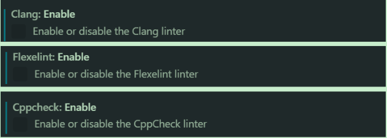

# vscode嵌入式Linux环境搭建


使用原因：

- 功能比source insight更强大
- 跨平台
- 大厂出品（微软）


## 1. 软件安装

官网：https://code.visualstudio.com

- 下载之后，Linux安装指令：

```bash
sudo dpkg -i code_1.32.3-1552606978_amd64.deb
```


- 创建桌面图标

```bash
# 1. 图形界面下，打开/usr/share/applications目录
# 2. 找到VScode，右键->复制到->桌面
```


## 2. 插件

```bash
1)、C/C++，这个肯定是必须的。 
2)、C/C++ Snippets，即 C/C++重用代码块。 
3)、C/C++ Advanced Lint,即 C/C++静态检测 。 
4)、Code Runner，即代码运行。 
5)、Include AutoComplete，即自动头文件包含。 
6)、Rainbow Brackets，彩虹花括号，有助于阅读代码。 
7)、One Dark Pro，VSCode 的主题。 
8)、GBKtoUTF8，将 GBK 转换为 UTF8。 
9)、ARM，即支持 ARM 汇编语法高亮显示。 
10)、Chinese(Simplified)，即中文环境。 
11)、vscode-icons，VSCode 图标插件，主要是资源管理器下各个文件夹的图标。 
12)、compareit，比较插件，可以用于比较两个文件的差异。 
13)、DeviceTree，设备树语法插件。 
14)、TabNine，一款 AI 自动补全插件，强烈推荐，谁用谁知道
```

- 修改中文显示

```bash
# 1. Ctrl+Shift+P 按键
# 2. 搜索框里输入“config”，然后选择“Configure Display Language”
# 3. 在打开的local.json文件中将locale修改为 "zh-cn"。（冒号不能省略）
```


## 3. 新建工作区

1. 新建一个文件夹用于存放工程，尽量不要有中文和空格
2. 在Vscode中，点击`文件`->`打开文件夹`，选择刚才创建的文件夹
3. 点击`文件`->`将工作区另存为...`，输入要保存的工作区路径和工作区名字
4. 保存工作区后，创建新建文件
5. 保存工作区后，在工作区目录下会有一个`xx.code-workspace`文件，双击即可打开。


## 4. 添加头文件路径

- `Ctrl + Shift + P`
- 输入`Edit configurations`，选择`C/C++: Edit configurations...`
- C/C++的配置文件是一个json文件，名为`c_cpp_properties.json`。该文件中的`includePath`用于指定工程的头文件。

[(2条消息) 使用IDE（vs code）进行嵌入式linux驱动开发_奇奇猴的博客-CSDN博客_linux驱动开发用什么ide](https://blog.csdn.net/y24283648/article/details/107981315)


## 5. 预览模式

预览模式下，我们单击左侧的文件就会覆盖掉当前已经打开的文件。

如果不想覆盖，可以用双击打开，或者设置VSCode关闭预览模式。




## 6. C/C++Lint插件报错

编写代码的时候，右下角有时候会报错：



原因：C/C++ Lint打开了几个功能

解决：我们将其关闭就可以



在 C/C++ Lint 配置界面上找到 CLang:Enable、Cppcheck:Enable、Flexlint:Enable 这个三个，然后取消掉勾选即可：



但是关闭 Cppcheck:Enable 以后 VSCode 就不能实时检查错误了，大家根据实际情况选择即可。


## 7. 主题

建议主题：One Dark Pro Bold


## 8. 更改字体

`设置`->`Edit:Font Size`


## 9. 终端功能

直接在VScode的终端下进行编译、执行等操作。


## 10. 常用快捷键

注释/取消注释：`ctrl + /`

显示/隐藏侧边栏：`ctrl + b`

显示/隐藏控制台终端：`ctrl + ~`

字体放大/缩小：`ctrl + +/-`

切换全屏：`F11`

当前文件查找：`ctrl + f`

全局查找文件：`ctrl + shift + f`

快速回到顶部：`ctrl + home`

快速回到底部：`ctrl + end`

全局替换：`ctrl + shift + h`

当前文件替换：`ctrl + h`

转到行：`ctrl + g`

转到下一个错误或警告：`F8`

选择所有出现的当前单词：`ctrl + F2`

转到定义：`F12`

返回（Ubuntu）：`ctrl + alt + -`

返回（Windows）：`alt + 左箭头`

