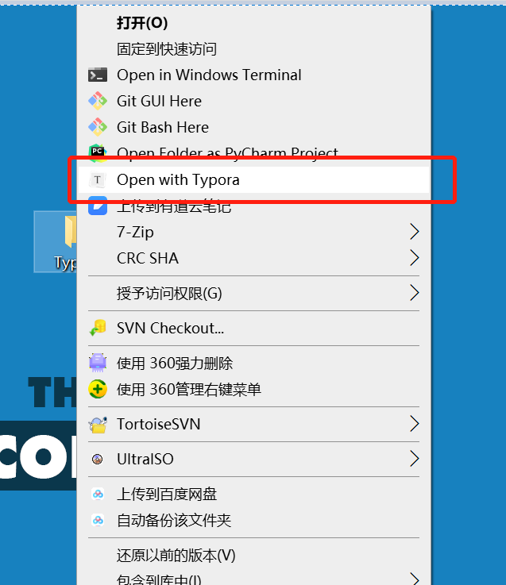

# 将Typora添加到右键菜单栏


## 背景介绍

老王平时都是用Typora写东西，每次都是先打开Typora软件，然后选择`文件`->`打开文件夹`，然后一通点击鼠标，终于把平时写草稿的文件夹打开了... 这繁琐的过程对老王这种懒人来说简直不能忍啊。难道就不能直接右键单击草稿文件夹，然后点一个`用Typora打开`，操作系统就帮我把这个文件夹在Typora里打开吗？

闲来无事，老王去网上搜了搜，果然有很多大佬已经搞定了，赶紧学一学。

网上常规的方法有两种，本质就是修改注册表：

- 方式1：直接运行`regedit`修改注册表
- 方式2：写个`注册表文件`，然后导入系统注册表

老王试了试，不知道为啥方式1一直不成功，方式2倒是很顺利。


## 干货部分

- 首先确定自己的Typora安装路径：在桌面上右键单击`Typora`图标，选择`打开文件所在的位置`就可以。老王的安装路径是`C:\ProgramFilesMy\Typora`。

- 随便在哪儿创建一个记事本文件，然后重命名为`typora.reg`，前面的名字不重要，重要的是后缀一定要是`.reg`。

- 找个文本编辑软件打开`typora.reg`，用记事本、Notepad++、vscode都行。

- 把下面的代码粘贴进去：

    ```
    Windows Registry Editor Version 5.00
    
    [HKEY_CLASSES_ROOT\*\shell\Typora]
    @="Open with Typora"
    "Icon"="C:\\ProgramFilesMy\\Typora\\Typora.exe"
    
    [HKEY_CLASSES_ROOT\*\shell\Typora\command]
    @="\"C:\\ProgramFilesMy\\Typora\\Typora.exe\" \"%1\""
    
    Windows Registry Editor Version 5.00
    
    [HKEY_CLASSES_ROOT\Directory\shell\Typora]
    @="Open with Typora"
    "Icon"="C:\\ProgramFilesMy\\Typora\\Typora.exe"
    
    [HKEY_CLASSES_ROOT\Directory\shell\Typora\command]
    @="\"C:\\ProgramFilesMy\\Typora\\Typora.exe\" \"%V\""
    
    Windows Registry Editor Version 5.00
    
    [HKEY_CLASSES_ROOT\Directory\Background\shell\Typora]
    @="Open with Typora"
    "Icon"="C:\\ProgramFilesMy\\Typora\\Typora.exe"
    
    [HKEY_CLASSES_ROOT\Directory\Background\shell\Typora\command]
    @="\"C:\\ProgramFilesMy\\Typora\\Typora.exe\" \"%V\""
    ```

- 把文件里所有`\\Typora.exe`之前的**路径部分**换成你刚才查的路径，然后把路径里的单斜杠`\`换成双斜杠`\\`。

- 保存文件，退出。
- 鼠标左键双击`typora.reg`文件，然后会弹出几个对话框提醒你`是不是要把这个注册表文件导入啊？`、`导入这玩意儿有风险，你可想好啊`，不用管它，闭着眼睛全选`是`就行了。

上面一通操作之后，随便找个文件夹，点击右键，就会发现右键菜单里多了一个`Open with Typoras`。只要轻轻一点，系统就会用`Typora`打开这个文件夹了。



