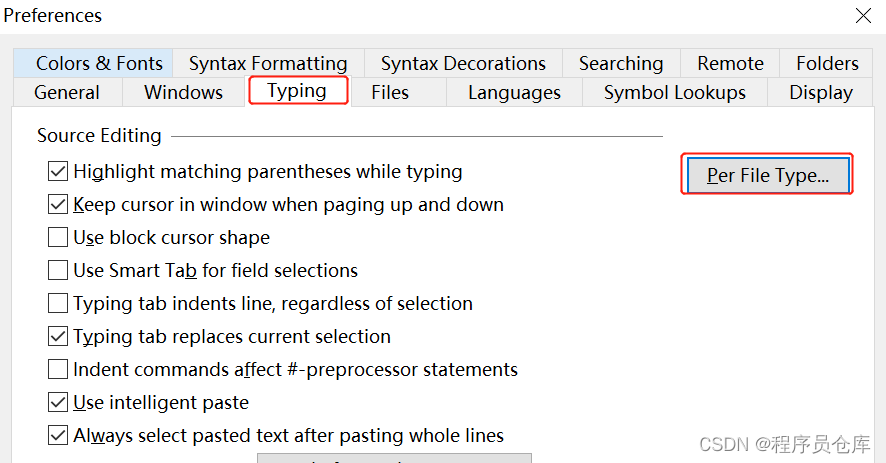
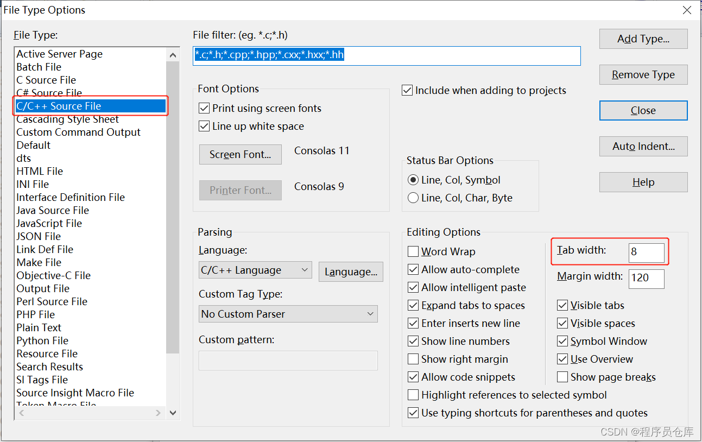

# 如何更改Source Insight 4.0中Tab的宽度

在阅读源码的过程中，经常会需要改变 Source Insight 的 `Tab`宽度以使代码更加易读，具体的步骤如下：

首先，选择`Options` -> `Preferences`：

然后，在弹出的对话框中依次选择`Typing` -> `Per File Type`：

第三，在`File Type`中选择要设置的文件类型，然后在右侧设置`Tab Width`的值，设置完成后按`回车`确认即可。

