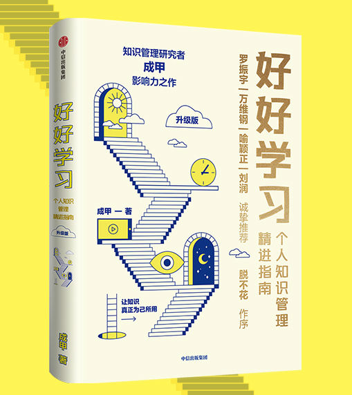

## 1. 书籍简介

- 作者：成甲
- 出版：中信出版集团股份有限公司
- 班次：2022年7月第2版
- 印次：2022年7月第1次印刷

## 2. 前言

- 要解决的现状

  当下，很多人都在热情追逐知识的获取，把获得当做重点。但是，后续的管理和实践才是将知识效益最大化的关键。

  互联网时代，获取信息非常容易，但人们急需解决的是：如何利用信息改变个人的思考和行为，最终将信息内化为知识。

- 本书的目的

  讲述学习的方法，知识管理的方法，最终希望能够帮助更多人的生活和行为发生改变。

> 反思：
>
> 在日常生活中，我们经常发现之前读过的文章和书都在不经意间被遗忘，感觉就像白白浪费了时间和精力。在本书中，作者引用/提出了一个观念：“只有改变你行动和思维的信息才是知识。” 所以，我们不应该盲目的追求数量，而是要追求自身的改变。哪怕我们只看了书中的一小部分，但能够坚持实践，改善我们的行为，那就是极大的收获。
>
> 作者在书中提到了“临界知识”，这和刘润《底层逻辑》中提到的“底层逻辑”、查理芒格《穷查理宝典》中提到的“普世智慧”类似，都是一种贴近本质的、可以跨领域应用的基本规律。这种规律，掌握一条就可以处理多种具体问题，有点“事半功倍”的意思。但是，想要掌握这种规律也不是一朝一夕就能达到的。所以，在学习“临界知识”的道路上，要少些急于求成的功利心，多多反思，多多实践。

## 3. 知识管理与认知优势

### 3.1. 现状形式分析

20 世纪 90 年代到 2000 年的时候，**知识数量**可以构建认知优势。在这个阶段，大学生、学院派很受重视，以咨询企业、广告公司等为代表的的知识密集型行业蓬勃发展。

2000年到现在，**知识的获取速度**可以构建认知优势。在这个阶段，谁能比别人快速的获取前沿知识，谁就更有可能成功。例如校内网、美团、微博等大型公司的成功，就是因为他们最早、最快的将国外的 Facebook、Twitter、Groupon 公司的模式搬到了国内。

从现在开始，我们基本开始步入依靠**知识深度**构造认知优势的时代。由于互联网的告诉发展，大家基本上都能快速的了解国际上最领先的知识。在知识数量和获取知识速度相同的前提下，对知识掌握的深度就变成了成功的关键。

知识管理的核心不是对知识进行搜集、分类、保存，而是通过管理知识提升我们的认知深度，进而改变我们的行为模式。

### 3.2. 如何提升认知深度

- 什么是深度认知

  分析问题时，能跳出问题本身，思考更普遍的情况。

  寻求答案的时候，能够根据理由的可信度判断是否接收这个结论。

- 什么是临界知识

  经过了更为广泛、长期的验证，在更普遍的领域具有指导意义和应用价值。

  掌握临界知识，便能开启学习的“少即是多”、“四两拨千斤”模式，从而极大提高学习效率。

- 如何提升认知深度？

  学会透过现象看本质

### 3.3. 为什么大多数人的学习层次上不去

- 原因：只注重提升`技术效率`，而不注重`认知效率`。
- 技术效率
  - 概念：不断掌握应对**具体**工作场景和问题的方法
  - 弊端：遇到每个新问题，都需要学习新知识
- 认知效率
  - 概念：了解问题本质，了解解决方案的底层规律，认清楚问题表象背后的实质。其实就是学习临界知识。
  - 优势：20%的知识解决80%的问题；一通百通

### 3.4. 到底哪些知识值得学

- 以斜杠青年和马斯克的例子，得出结论：斜杠是提升认知深度的结果，而不是追求多元的结果。

- 论点：要学习与解决某一类问题相关的所有核心能力，一定要突破专业限制。

  论据：我们平时提到的专业， 例如市场营销、法律、政治等，都是人为制造的标签罢了，但这个世界不是按照你划分的标签在各个专业领域内单独运行的。例如，一个市场营销的问题，背后往往涉及法律、政治、历史和文化等因素。

- 作者理念：各种表面上看起来“无用”的、不相干的知识，最后都会在底层联系起来。讲这些“不相干”的事情联系起来的，就是临界知识。

- 值得学：

  - 公共基础课

    每天都会用到的执行能力，例如时间管理、资料保存、商务礼仪、沟通谈判等。市面上有很多教程。

  - 专业必修课（重要）

    我们在某一个领域内，能够完整打完正常战役、解决系统问题的能力。需要跨学科地思考、解决问题，一个人活成一支队伍。

  - 通用必修课（重要）

    掌握临界知识，认知事务更底层的结构和规律。例如：我们经营的领域是如何产生的？影响这个领域发展的基本动力是什么？有哪些规律会普遍地影响这些事务？

> 反思：
>
> 1. 不要局限于人为划分的”专业“，要有跨学科的概念，具备领域型的系统思维。
> 2. 不要局限于解决具体问题的能力，要多学习临界知识。

## 4. 掌握临界知识的底层思维与方法

### 4.1. 跳出“低水平勤奋陷阱”

- 读书时只是摘抄是没有用的。

- 读书不要追求速度，要自己主动思考**把新知识和旧知识联系起来**，这样才能记忆深刻。（外延：记忆宫殿法）
- 看到一个问题的解决方案，要**思考它解决问题的底层逻辑是什么，我们以后能否用这个逻辑解决其他类型的问题**。
- 读书不在于多少，而在于你有没有通过读书重新认识世界，发现临界知识并把它运用到生活中。

> 反思：
>
> 1. 把新旧知识建立联系，符合”温故而知新，可以为师矣“的理论。
> 2. 作者一再强调的“临界知识”，与刘润的“底层逻辑”、查理芒格的“普世智慧”基本是相同的理念。

### 4.2. 学习临界知识要具备两个底层心态

如果要实现学习效率的小幅提升，可能只需要掌握或改进一个新方法、新技巧就可以了；但如果要有大幅度的提升或质变，一定会涉及对自己底层认知的改变。这种改变会触及一些更本质的问题，比如：你相信什么？你如何看待你与这个世界的关系。

#### 4.2.1. 绿灯思维

- 什么是绿灯思维

  绿灯思维是指当遇到新观点或者不同的意见时，第一反应是”哇，这个观点一定有用！我应该怎么用他来帮助自己？“，在理解新观点的用途和价值后，再去分析这个观点可能的不足，想办法完善它。

- 为什么大部分人没有绿灯思维

  人天生就会有“习惯性防卫”的意识，这就导致当我们感觉到自己的观点、尊严可能会收到挑战的时候，我们的第一反应不是思考对方的挑战和质疑是否合理，而是“有人敢反对我，和他干！”。

  - 为什么会有“习惯性防卫”？

    这和“基本归因偏差”有关。“基本归因偏差”是指当问题出现在别人身上的时候，我们习惯这个问题归因于别人，认为是那个人自身有问题；当问题出现在自己身上的时候，我们会把问题归因于外部因素。简单说就是：别人出事儿，都是人品问题；自己出事儿，就是外部环境问题。这个现象反过来也成立，别人成功的时候，我们会认为是因为他走运；我们自己成功的时候，会觉得是因为我们自身的努力。

    基于“基本归因偏差”，当受到质疑的时候，我们会下意识的找外部原因。当我们把外部原因当真之后，自然就觉得别人针对我们的意见显得更不合理了。

- 如何培养绿灯思维

  - 区分“我”和“我的观点/行为”

    不要把别人对我们观点/行为的质疑，理解为对我们自身的否定。“我”和“我的观点/行为”是不一样的，我们的成长来自“我的观点/行为”的改进和提升，而别人对“我的观点/行为”提出意见，正是我们成长的机会。

#### 4.2.2. 以慢为快

- 以慢为快是在学习过程中应该保持的心态。

- 快是结果，不是原因。想要能力提升的快，不是说学习的过程就要很快。

  > 反思：
  >
  > 学习某一个知识，囫囵吞枣的快速学习，最终的结果就是很快遗忘。过一段时间，还需要再重新学一遍，这样反而浪费更多的时间。

- 真正高效的学习，是知识融会贯通的结果。有了对重要的核心知识的深刻理解，我们运用起知识来才能游刃有余。导致我们无法“融汇贯通”的原因，就是我们感觉核心知识不好理解时，选择了略过，而不是努力弄懂。

- 把慢功夫用在真问题上。以慢为快，不是学习过程中每个阶段都要慢。根据二八定律，要把 80% 的时间用在 20% 的核心知识上。

  > 反思：
  >
  > 学习过程中，核心知识（例如，临界知识）一定要花费足够的时间、精力去搞懂，不能囫囵吞枣的学习。至于其他非关键知识，则可以只投入少量的时间、精力。

### 提升学习能力的三个底层方法

#### 学习的本质

- 学习临界知识的过程，本身就是深度思考的过程。
- 关于假设：我们所有的观点、结论，本质上都是一个假设。观点和结论的好坏，取决于我们的假设与事实相符的程度。

- 学习的本质是改变我们假设的过程，因为我们所有的决策都是在自己的假设下做出的。学习临界知识就是用更合理的假设替代之前相对不合理的假设，从而让我们的决策质量更高。

  从这个角度看，学习临界知识最方便的教材是复盘我们每天的生活：每个决策是在什么假设下做出的，产生了什么结果，如何改进。我们要追问问题的过程，而不是仅仅是事后解释为什么。

- 过去的经历，是写满了我们弱点、优点、错误假设和生活灵感的文章。经过反思，才能称为知道我们未来的宝典。

#### 方法一：反思 - 提升知识掌握的层次

理念更新：反思不同于总结。总结是对结果的好坏进行分析；反思是对**产生结果的原因**进行分析。

反思时，多去探寻底层逻辑，运用底层逻辑进行解释。

**反思的作用：**

- **帮助我们发现知识误区：跳跃性假设**

  跳跃性假设概念的引入：《影响力》，作者西奥迪尼：“人就像录音机一样，一按按钮就播放。”

  跳跃性假设的定义：未经思考，面对某种场景就立刻得出结论；跳过理性思考的环节做出的假设。

  跳跃性假设的示例：我印象最深的例子是，我读大学时，每当遇到比自己能力更优秀、职级更高或影响力更大的人，我的第一反应都是往后退，而不愿意靠近和接触这样的人。虽然事情过后，内心有些自责，希望下次自己能够和这样的人多接触学习，但是下一次再遇到这样的情况时，我又会不由自主地后退逃避。

  关于假设（作者理念）：我们生活的真实世界，是我们认为的真实世界。也就是说，我们对这个世界的认知，都是一种假设，而我们的假设是大脑对事实进行解读之后形成的：事实 -> 大脑解读 -> 假设 -> 行为。我们成长的过程，便是让我们的假设更加接近事实的过程。而跳跃性假设，由于省略了理性思考的过程，往往不是最合理的假设。

  跳跃性假设的解决方案：放慢思考速度，找到更合理的方案。问自己：做出决策的过程合理吗？要实现目标还有其他方法吗？考虑的因素全面吗？

  > 非主线知识：如果凡事都以目前的能力来评断能与不能，那么任何新的、困难的事物，无论再过多久，也不会有完成的一天。-- 稻和盛夫

  收效预期：事实上，在某一阶段，对自己工作生活影响重大的跳跃性假设的数量是非常有限的，但是它们重复出现在不同的时间和场合，影响着我们的决策。一旦发现并改进了这一跳跃性假设，我们便能极大地改善生活中很多问题的处理方法。

- **促进已有知识产生新知识**

  方法：反思一件事情的时候通过联想和联结，将其与生活中其他经历和经验串联起来，重新认识和审视自己过往经历的办法，能够将自己分散的生活经
  验进行重新组织，从而产生新的知识。问自己：我过去遇到过类似的事情吗？我听说过其他犯过类似的错或者做得更好的人吗？有什么相关的方法可以应用到这件事情中吗？

  > 非主线知识：损失规避效应是指我们面对损失时的痛苦感要大大超过面对获得时的快感。比如你今天丢了 1000 元，会觉得很痛苦，即使晚上又捡到 1000元，你捡到 1000 元的快乐也不能抵消你丢失 1000 元的不愉快。

- **检验学习的新知识是否用了起来**

  方法：提前为自己指定一个标准（要把哪些知识用起来），然后每天反思，比较与预期的差距。

  > 非主线知识：对标管理由美国施乐公司于 1979 年首创，是现代西方发达国家企业管理活动中支持企业不断改进和获得竞争优势的最重要的管理方式之一，被称为 20 世纪 90 年代三大管理方法之一。

**提升反思能力的三个方法：**

- **从小事反思，深入突破**

  为什么要反思小事：决定你在关键时刻表现的，却是一件件小事的积累——临场的发挥、沟通的技巧、心态的调整

  反思时要记录自己的情绪和思考的过程，而不仅仅是记录事情的结果，尽可能的深挖。

- **把生活案例化处理**

  生活每天都在生产未经加工的经验素材。我们的判断来源于经验，而有效的经验来源于对判断的反思。反思，让我们对生活的素材重新解读，成为洞见。

  生活就是一本书，我们每天经历的事情，都是一个个埋藏着启发的案例，关键是我们必须有能力解读它。首先，我们要把生活中重要的部分选择出来，然后才能从中发现更有价值的启发。而这个过程，就是在锻炼反思的能力。

- **培养写反思日记的习惯**

  底层逻辑：人的进步和行为的改变，往往源自反馈。如果你不知道你的行为产生了什么影响，你是不会改进的。反思日记，是一个帮助我们主动对行为的影响进行反馈的工具。

#### 方法二：以教为学

**为什么有用？**

- 第一，因为要讲清楚，就会督促自己发现知识阻塞，进一步打通已有知识。

- 第二，讲清楚的过程，是一个强化记忆和认识的过程。复述知识其实是强化记忆神经链的过程。短期记忆转化成长期记忆的关键就是不断重复。而教别人，是一个很好的建立长期记忆的过程，而且教学的环境让我们对知识的记忆增添了新的场景，回忆起来更容易。

- 第三，和别人分享之后，别人提出疑问和新想法，会增强我们的认识。

  > 非主线知识：你在处于职员位置的时候，就要思考这样的问题——“如果我的职级比现在高两级，我会怎么做？”

**技巧：**

- 分享不能知道多少讲多少，而要为讲清楚这个问题大量查阅资料，购买书籍。
- 在准备中，一定要主动查询不同的观点和不支持自己结论的反面案例。只有真正知道我们拥有的知识的局限性所在，我们才配真正拥有这个知识。如果不能确信这一点，也没关系，可以在分享中坦诚地说明，这也有助于大家进一步探讨学习。

> 知识串联：费曼学习法

#### 方法三：刻意练习

刻意练习，就是提升元认知能力的过程。

元认知是对我们的思考过程的思考。

我们在元认知上的差别表现为认知效率与认知深度上的差别。

刻意练习最关键的还不是掌握具体的临界知识，而是要改变我们的思考过程：有意识地应用更高级的心理表征解决问题，提升元认知能力。

> 心理表征：所谓心理表征，是指我们的大脑在思考问题时对应的心理结构。这个定义太抽象，让我们举个容易理解的例子。比如下象棋，一个新手下棋的时候，看到的都是车、马、炮，“马走日，象走田”，而一个大师看到的却是棋局走势与可能的策略。这种对同一个问题不同的认知方式，就是心理表征的差别。

通过刻意练习提升元认知的方法：

- 对基本核心知识划小圈

  划小圈的内容就是我前面提到的对基本概念、临界知识、知识阻塞等关键地方进行反复的探究和思考，直到把这个问题吃透、弄明白。

- 将基本知识组合成更大的能力单元

  示例：比如对最基本的营销概念、市场概念理解透彻后，就能够建立在这些概念之上的认识，形成市场分析和判断的能力。

- 在各知识能力单元之间构建认知框架
